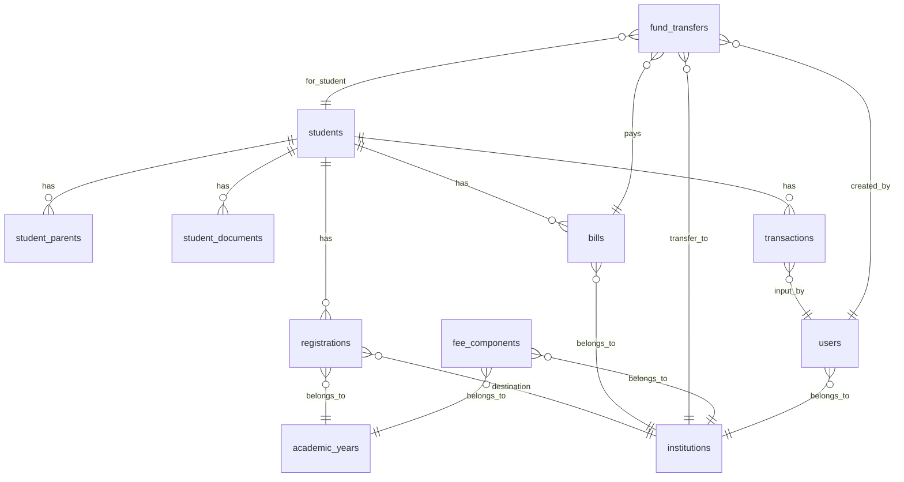

# Struktur Database

> Dokumentasi lengkap tentang skema database, tabel, dan relasi antar entitas.

**Dokumentasi Terkait:**
- [← Kembali ke README](../README.md)
- [Instalasi & Konfigurasi](./INSTALLATION.md)
- [Status & Workflows](./STATUS_WORKFLOWS.md)

---

## Entity Relationship Diagram (ERD)

---

## Tabel Utama

### 1. `students` - Data Santri

| Field | Type | Deskripsi |
|-------|------|-----------|
| `id` | bigint | Primary key |
| `registration_number` | varchar | Nomor pendaftaran unik (format: `YYXXXX`) |
| `full_name` | varchar | Nama lengkap |
| `nik` | varchar | NIK (unique) |
| `nisn` | varchar | NISN (optional) |
| `place_of_birth` | varchar | Tempat lahir |
| `date_of_birth` | date | Tanggal lahir |
| `gender` | enum | `male`, `female` |
| `child_number` | int | Anak ke- |
| `total_siblings` | int | Jumlah saudara |
| `address_street` | text | Alamat jalan |
| `village` | varchar | Desa/Kelurahan |
| `district` | varchar | Kecamatan |
| `regency` | varchar | Kabupaten/Kota |
| `province` | varchar | Provinsi |
| `postal_code` | varchar | Kode pos |
| `status` | enum | `draft`, `verified`, `accepted`, `rejected` |

**Model**: `app/Models/Student.php`

---

### 2. `registrations` - Detail Pendaftaran

| Field | Type | Deskripsi |
|-------|------|-----------|
| `id` | bigint | Primary key |
| `student_id` | FK | Relasi ke students |
| `academic_year_id` | FK | Tahun ajaran |
| `previous_school_level` | varchar | Jenjang sekolah asal |
| `previous_school_name` | varchar | Nama sekolah asal |
| `previous_school_npsn` | varchar | NPSN sekolah asal |
| `previous_school_address` | text | Alamat sekolah asal |
| `destination_institution_id` | FK | Lembaga tujuan (SMP/MA) |
| `destination_class` | varchar | Kelas tujuan |
| `funding_source` | varchar | Sumber biaya |

**Relasi**: `students` 1:1 `registrations`

---

### 3. `student_parents` - Data Orang Tua

| Field | Type | Deskripsi |
|-------|------|-----------|
| `id` | bigint | Primary key |
| `student_id` | FK | Relasi ke students |
| `type` | enum | `father`, `mother`, `guardian` |
| `name` | varchar | Nama |
| `life_status` | enum | `alive`, `deceased`, `unknown` |
| `nik` | varchar | NIK |
| `place_of_birth` | varchar | Tempat lahir |
| `date_of_birth` | date | Tanggal lahir |
| `education` | varchar | Pendidikan terakhir |
| `pesantren_education` | varchar | Pendidikan pesantren |
| `job` | varchar | Pekerjaan |
| `income` | varchar | Penghasilan |
| `phone_number` | varchar | Nomor telepon |

**Relasi**: `students` 1:N `student_parents`

---

### 4. `student_documents` - Dokumen Upload

| Field | Type | Deskripsi |
|-------|------|-----------|
| `id` | bigint | Primary key |
| `student_id` | FK | Relasi ke students |
| `type` | varchar | `kk`, `akta`, `ijazah`, `foto` |
| `file_path` | varchar | Path file di storage |
| `status` | enum | `pending`, `valid`, `invalid` |

**Relasi**: `students` 1:N `student_documents`

---

## Tabel Master Data

### 5. `institutions` - Lembaga

| Field | Type | Deskripsi |
|-------|------|-----------|
| `id` | bigint | Primary key |
| `name` | varchar | Nama lembaga |
| `type` | varchar | `pondok`, `madrasah`, `smp`, `ma`, `mts` |

**Data Default (dari seeder):**
| Nama | Type |
|------|------|
| Pondok Pesantren Dar Al Tauhid | `pondok` |
| Madrasah Dar Al Tauhid | `madrasah` |
| SMP Plus Dar Al Tauhid | `smp` |
| MA Nusantara | `ma` |
| MTsN 3 Cirebon | `mts` |

---

### 6. `academic_years` - Tahun Ajaran

| Field | Type | Deskripsi |
|-------|------|-----------|
| `id` | bigint | Primary key |
| `name` | varchar | Contoh: `2026/2027` |
| `is_active` | boolean | Status aktif |

> ⚠️ Hanya boleh ada 1 tahun ajaran aktif pada satu waktu.

---

### 7. `fee_components` - Komponen Biaya

| Field | Type | Deskripsi |
|-------|------|-----------|
| `id` | bigint | Primary key |
| `institution_id` | FK | Lembaga pemilik |
| `academic_year_id` | FK | Tahun ajaran |
| `name` | varchar | Nama komponen (Pendaftaran, dll) |
| `type` | enum | `yearly`, `monthly` |
| `amount` | decimal(15,2) | Nominal |

**Relasi**: 
- `institutions` 1:N `fee_components`
- `academic_years` 1:N `fee_components`

---

## Tabel Keuangan

### 8. `bills` - Tagihan

| Field | Type | Deskripsi |
|-------|------|-----------|
| `id` | bigint | Primary key |
| `student_id` | FK | Santri pemilik tagihan |
| `institution_id` | FK | Lembaga tujuan |
| `amount` | decimal(15,2) | Total tagihan |
| `remaining_amount` | decimal(15,2) | Sisa tagihan |
| `status` | enum | `unpaid`, `partial`, `paid` |
| `description` | text | Rincian komponen |

> **Auto-generated** saat santri mendaftar via `Student::generateBills()`

**Relasi**:
- `students` 1:N `bills`
- `institutions` 1:N `bills`

---

### 9. `transactions` - Pembayaran

| Field | Type | Deskripsi |
|-------|------|-----------|
| `id` | bigint | Primary key |
| `student_id` | FK | Santri yang membayar |
| `user_id` | FK | Petugas input |
| `amount` | decimal(15,2) | Jumlah bayar |
| `payment_method` | enum | `cash`, `transfer` |
| `transaction_date` | date | Tanggal transaksi |
| `proof_image` | varchar | Bukti pembayaran |
| `notes` | text | Catatan |
| `payment_location` | enum | `PANITIA`, `UNIT` |
| `is_settled` | boolean | Sudah didistribusikan? |
| `verification_token` | varchar(64) | Token verifikasi kwitansi |

**Relasi**:
- `students` 1:N `transactions`
- `users` 1:N `transactions`

---

### 10. `fund_transfers` - Distribusi Dana

| Field | Type | Deskripsi |
|-------|------|-----------|
| `id` | bigint | Primary key |
| `institution_id` | FK | Lembaga tujuan |
| `student_id` | FK | Santri terkait |
| `bill_id` | FK | Tagihan yang dibayar |
| `transaction_id` | FK | Transaksi asal |
| `user_id` | FK | Pembuat request |
| `amount` | decimal(15,2) | Jumlah transfer |
| `transfer_date` | date | Tanggal transfer |
| `transfer_method` | varchar | Metode transfer |
| `notes` | text | Catatan |
| `status` | enum | `PENDING`, `APPROVED`, `COMPLETED`, `REJECTED` |
| `approved_at` | timestamp | Waktu approval |
| `approved_by` | FK | User yang approve |
| `received_at` | timestamp | Waktu terima |
| `received_by` | FK | User yang terima |

**Relasi**:
- `institutions` 1:N `fund_transfers`
- `students` 1:N `fund_transfers`
- `bills` 1:N `fund_transfers`

---

### 11. `users` - User Admin

| Field | Type | Deskripsi |
|-------|------|-----------|
| `id` | bigint | Primary key |
| `name` | varchar | Nama |
| `email` | varchar | Email (unique) |
| `password` | varchar | Password (hashed) |
| `position` | varchar | Jabatan |
| `institution_id` | FK | Lembaga (nullable) |

**Relasi**: `institutions` 1:N `users`

---

## Migrations (Urutan)

| No | File | Deskripsi |
|----|------|-----------|
| 1 | `0001_01_01_000000_create_users_table.php` | Tabel users |
| 2 | `2025_03_01_000001_create_master_data_tables.php` | institutions, academic_years, fee_components |
| 3 | `2025_03_01_000002_create_students_tables.php` | students, student_parents |
| 4 | `2025_03_01_000003_create_registration_details_tables.php` | registrations, student_documents |
| 5 | `2025_03_01_000004_create_finance_tables.php` | bills, transactions |
| 6 | `2025_03_01_000007_create_fund_transfers_table.php` | fund_transfers |
| 7 | `2025_12_29_172047_create_permission_tables.php` | Spatie Permission |

---

## Models Reference

| Model | File |
|-------|------|
| Student | `app/Models/Student.php` |
| Registration | `app/Models/Registration.php` |
| StudentParent | `app/Models/StudentParent.php` |
| StudentDocument | `app/Models/StudentDocument.php` |
| Institution | `app/Models/Institution.php` |
| AcademicYear | `app/Models/AcademicYear.php` |
| FeeComponent | `app/Models/FeeComponent.php` |
| Bill | `app/Models/Bill.php` |
| Transaction | `app/Models/Transaction.php` |
| FundTransfer | `app/Models/FundTransfer.php` |
| User | `app/Models/User.php` |

---

*Dokumentasi ini terakhir diperbarui pada: Januari 2026*
