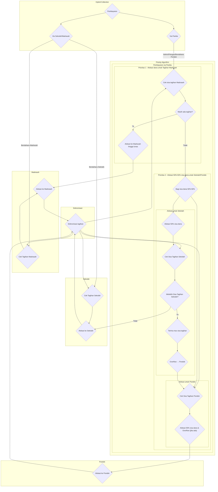

```mermaid
flowchart TD
    subgraph HYBRID_COLLECTION ["Hybrid Collection"]
        A{"Pembayaran"}
        A1{"Via Panitia"}
        A2{"Via Sekolah/Madrasah"}
    end

    subgraph PONDOK ["Pondok"]
        B{"Alokasi ke Pondok"}
    end

    subgraph MADRASAH ["Madrasah"]
        C{"Cek Tagihan Madrasah"}
        C1{"Alokasi ke Madrasah"}
    end

    subgraph SEKOLAH ["Sekolah"]
        D{"Cek Tagihan Sekolah"}
        D1{"Alokasi ke Sekolah"}
    end

    subgraph SINKRONISASI ["Sinkronisasi"]
        E{"Sinkronisasi tagihan"}
    end

    subgraph ALGORITHM ["Priority Algorithm"]
        subgraph PANITIA ["Pembayaran via Panitia"]
            subgraph PRIORITY1 ["Prioritas 1 - Alokasi dana untuk Tagihan Madrasah"]
                F{"Cek sisa tagihan Madrasah"}
                F1{"Masih ada tagihan?"}
                F2{"Alokasi ke Madrasah hingga lunas"}
            end

            subgraph PRIORITY2 ["Prioritas 2 - Alokasi 50%:50% sisa dana untuk Sekolah/Pondok"]
                G{"Bagi sisa dana 50%:50%"}

                subgraph SEKOLAH_SPLIT["Alokasi untuk Sekolah"]
                H{"Alokasi 50% sisa dana"}
                H1{"Cek Sisa Tagihan Sekolah"}
                H2{"Melebihi Sisa Tagihan Sekolah?"}
                H3{"Terima max sisa tagihan"}
                H4{"Overflow → Pondok"}
                end

                subgraph PONDOK_SPLIT["Alokasi untuk Pondok"]
                I{"Cek Sisa Tagihan Pondok"}
                I1{"Alokasi 50% sisa dana & Overflow (jika ada)"}
                end
            end
        end
    end

    %% Hybrid Collection
    A --> A1
    A --> A2
    A1 --> |Admin/Petugas/Bendahara Pondok| F
    A2 --> |Bendahara Madrasah| C
    A2 --> |Bendahara Sekolah| D

    %% Madrasah
    C --> C1

    %% Sekolah
    D --> D1

    %% Pondok

    %% Sinkronisasi
    C1 --> E
    D1 --> E
    B --> E
    E --> C
    E --> D
    E --> F
    E --> H1
    E --> I


    %% Priority Algorithm
    %% Priority 1
    F --> F1 
    F1 --> |Ya| F2 -->C1
    F1 --> |Tidak| G

    %% Priority 2
    G --> H
    G --> I
    H --> H1 -->H2
    H2 --> |Tidak| D1
    H2 --> |Ya| H3 --> H4 --> I --> I1 --> B


```