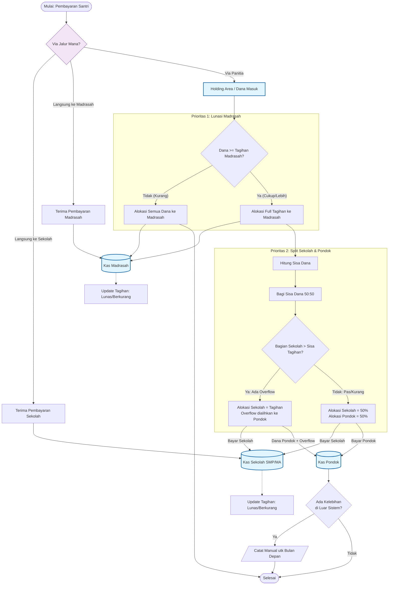

```mermaid
flowchart TD
    %% =========================================================================
    %% DEFINISI NODES & STYLE
    %% =========================================================================
    
    %% Terminal Nodes
    Start([Mulai: Pembayaran Santri])
    End([Selesai])
    ManualLog[/Catat Manual utk Bulan Depan/]

    %% Input / Decision
    Source{Via Jalur Mana?}
    
    %% Storage / Database (Kas)
    KasMadrasah[(Kas Madrasah)]
    KasSekolah[(Kas Sekolah SMP/MA)]
    KasPondok[(Kas Pondok)]
    
    %% Holding Area
    Holding[Holding Area / Dana Masuk]

    %% Styles
    classDef storage fill:#e1f5fe,stroke:#01579b,stroke-width:2px;
    classDef process fill:#fff3e0,stroke:#e65100,stroke-width:1px;
    classDef decision fill:#f3e5f5,stroke:#4a148c,stroke-width:1px;
    
    class KasMadrasah,KasSekolah,KasPondok,Holding storage;
    class Source,Check_Madrasah,Check_Sekolah,Check_Lebihan decision;

    %% =========================================================================
    %% ALUR DIAGRAM
    %% =========================================================================

    Start --> Source

    %% ---------------------------------------------------------
    %% JALUR 1: PEMBAYARAN LANGSUNG (DIRECT)
    %% ---------------------------------------------------------
    Source -->|"Langsung ke Sekolah"| DirectSekolah[Terima Pembayaran Sekolah]
    DirectSekolah --> KasSekolah

    Source -->|"Langsung ke Madrasah"| DirectMadrasah[Terima Pembayaran Madrasah]
    DirectMadrasah --> KasMadrasah

    %% Note for Direct: Side Effect implicit
    KasSekolah -.-> UpdateTagihanSekolah[Update Tagihan: Lunas/Berkurang]
    KasMadrasah -.-> UpdateTagihanMadrasah[Update Tagihan: Lunas/Berkurang]

    %% ---------------------------------------------------------
    %% JALUR 2: VIA PANITIA (PRIORITY ALGORITHM)
    %% ---------------------------------------------------------
    Source -->|"Via Panitia"| Holding
    
    %% PRIORITY 1: MADRASAH
    subgraph Prio1 [Prioritas 1: Lunasi Madrasah]
        Check_Madrasah{Dana >= Tagihan Madrasah?}
        Pay_Full_Madrasah[Alokasi Full Tagihan ke Madrasah]
        Pay_Partial_Madrasah[Alokasi Semua Dana ke Madrasah]
    end

    Holding --> Check_Madrasah
    
    %% Case: Dana Kurang -> Partial Payment & STOP
    Check_Madrasah -->|"Tidak (Kurang)"| Pay_Partial_Madrasah
    Pay_Partial_Madrasah --> KasMadrasah
    Pay_Partial_Madrasah --> End

    %% Case: Dana Cukup -> Full Payment & CONTINUE
    Check_Madrasah -->|"Ya (Cukup/Lebih)"| Pay_Full_Madrasah
    Pay_Full_Madrasah --> KasMadrasah
    Pay_Full_Madrasah --> Calc_Sisa[Hitung Sisa Dana]

    %% PRIORITY 2: SPLIT SEKOLAH & PONDOK
    subgraph Prio2 [Prioritas 2: Split Sekolah & Pondok]
        Calc_Sisa --> Split[Bagi Sisa Dana 50:50]
        Split --> Check_Sekolah{Bagian Sekolah > Sisa Tagihan?}
        
        %% Case: Sekolah Overflow (Dana Sekolah > Tagihan)
        Check_Sekolah -->|"Ya: Ada Overflow"| Set_Overflow[Alokasi Sekolah = Tagihan\nOverflow dialihkan ke Pondok]
        
        %% Case: Sekolah Normal (Dana Sekolah <= Tagihan)
        Check_Sekolah -->|"Tidak: Pas/Kurang"| Set_Normal[Alokasi Sekolah = 50%\nAlokasi Pondok = 50%]
    end

    %% Eksekusi Alokasi dari Prio 2 ke Kas
    Set_Overflow -->|"Bayar Sekolah"| KasSekolah
    Set_Overflow -->|"Dana Pondok + Overflow"| KasPondok

    Set_Normal -->|"Bayar Sekolah"| KasSekolah
    Set_Normal -->|"Bayar Pondok"| KasPondok

    %% ---------------------------------------------------------
    %% FINAL CHECK & MANUAL HANDLING
    %% ---------------------------------------------------------
    KasPondok --> Check_Lebihan{Ada Kelebihan\ndi Luar Sistem?}
    Check_Lebihan -->|"Ya"| ManualLog
    Check_Lebihan -->|"Tidak"| End
    ManualLog --> End

```