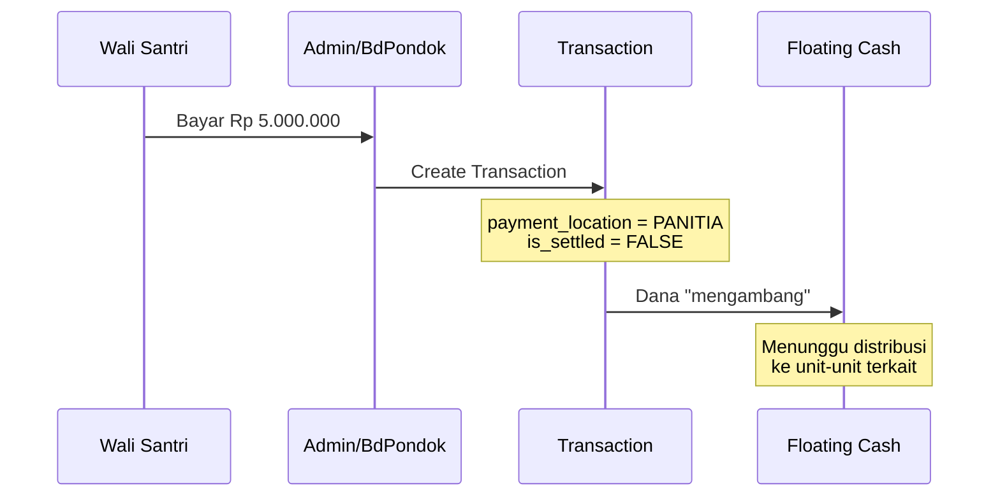
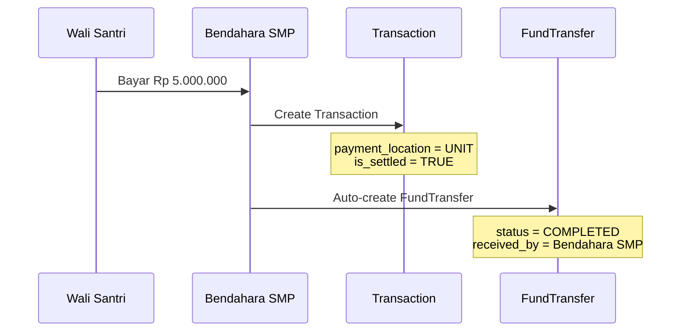

# Hybrid Cash Collection

Sistem tracking lokasi uang fisik di Pondok Pesantren, membedakan antara pembayaran yang diterima di **Panitia (pusat)** vs di **Unit (langsung ke lembaga)**.

## Konsep Dasar

### Masalah yang Dipecahkan

Dalam operasional pesantren, pembayaran dapat diterima di berbagai lokasi:
1. **Panitia PSB** - Pembayaran terpusat yang harus didistribusikan ke unit-unit
2. **Langsung ke Unit** - Santri/wali bayar langsung ke Bendahara Unit

Sistem ini melacak **di mana uang fisik berada** untuk mencegah:
- Double counting
- Dana "hilang" karena tidak tercatat
- Ketidakjelasan siapa yang memegang uang

## Arsitektur

```
┌─────────────────────────────────────────────────────────────────┐
│                      SANTRI MEMBAYAR                            │
└─────────────────────┬───────────────────────────────────────────┘
                      │
          ┌───────────┴───────────┐
          ▼                       ▼
┌─────────────────────┐  ┌─────────────────────┐
│      PANITIA        │  │        UNIT         │
│   (Admin/BdPondok)  │  │   (Bendahara Unit)  │
└─────────┬───────────┘  └─────────┬───────────┘
          │                        │
          ▼                        ▼
┌─────────────────────┐  ┌─────────────────────┐
│ payment_location    │  │ payment_location    │
│ = "PANITIA"         │  │ = "UNIT"            │
│                     │  │                     │
│ is_settled = FALSE  │  │ is_settled = TRUE   │
│ "Floating Cash"     │  │ Auto-completed      │
└─────────────────────┘  └─────────────────────┘
          │                        │
          ▼                        ▼
┌─────────────────────┐  ┌─────────────────────┐
│ Perlu DISTRIBUSI    │  │ FundTransfer        │
│ via Manual          │  │ status = COMPLETED  │
│ Settlement          │  │ Auto-created        │
└─────────────────────┘  └─────────────────────┘
```

## Field Database

### Transaction Table

| Field | Type | Deskripsi |
|-------|------|-----------|
| `payment_location` | enum | `PANITIA` atau `UNIT` |
| `is_settled` | boolean | Sudah didistribusikan? |

### Penentuan Otomatis

Saat transaksi dibuat, sistem otomatis menentukan `payment_location` berdasarkan **role user yang menginput**:

| Role User | payment_location | is_settled |
|-----------|------------------|------------|
| Administrator | PANITIA | FALSE |
| Bendahara Pondok | PANITIA | FALSE |
| Petugas | PANITIA | FALSE |
| Bendahara Unit | UNIT | TRUE |

## Alur Pembayaran

### 1. Pembayaran di PANITIA



**Setelah itu:**
- Dana tercatat di **Floating Cash at Panitia**
- Perlu **Manual Settlement** untuk distribusi ke unit

### 2. Pembayaran di UNIT



**Proses otomatis:**
- `FundTransfer` langsung dibuat dengan status `COMPLETED`
- Dana tercatat sudah diterima unit
- **Tidak perlu** approval atau settlement manual

## Implementasi Teknis

### CreateTransaction Logic

```php
// app/Filament/Resources/TransactionResource/Pages/CreateTransaction.php

protected function handleRecordCreation(array $data): Model
{
    $user = auth()->user();
    
    // Determine payment location based on user role
    $isUnitUser = $user->hasRole('Bendahara Unit') && $user->institution_id;
    $paymentLocation = $isUnitUser ? 'UNIT' : 'PANITIA';
    
    // Create transaction
    $transaction = Transaction::create([
        'student_id' => $studentId,
        'amount' => $amountToPay,
        'payment_location' => $paymentLocation,
        'is_settled' => $isUnitUser, // UNIT = already settled
        // ... other fields
    ]);
    
    // For UNIT payments, auto-create COMPLETED FundTransfer
    if ($isUnitUser) {
        FundTransfer::create([
            'institution_id' => $user->institution_id,
            'student_id' => $studentId,
            'bill_id' => $bill->id,
            'transaction_id' => $transaction->id,
            'amount' => $payForThisBill,
            'status' => 'COMPLETED',
            'received_at' => now(),
            'received_by' => $user->id,
        ]);
    }
    
    return $transaction;
}
```

### Transaction Model Methods

```php
// app/Models/Transaction.php

// Check if payment is at PANITIA (central collection)
public function isAtPanitia(): bool
{
    return $this->payment_location === 'PANITIA';
}

// Check if payment is at UNIT (direct collection)
public function isAtUnit(): bool
{
    return $this->payment_location === 'UNIT';
}

// Mark this transaction as settled (funds distributed)
public function markAsSettled(): void
{
    $this->update(['is_settled' => true]);
}

// Get friendly payment location label
public function getPaymentLocationLabel(): string
{
    if ($this->payment_location === 'PANITIA') {
        return 'Panitia';
    }
    
    // For UNIT, get institution name from user
    if ($this->user && $this->user->institution) {
        return 'Bendahara ' . $this->user->institution->name;
    }
    
    return 'Unit';
}
```

## Floating Cash Calculation

### Di Panitia

```php
// PaymentDistributionService.php

public function getFloatingCashAtPanitia(): float
{
    return (float) Transaction::where('payment_location', 'PANITIA')
        ->where('is_settled', false)
        ->sum('amount');
}
```

### Di Unit

```php
public function getCashAtUnit(Institution $institution): float
{
    // Direct unit payments
    $directPayments = (float) Transaction::where('payment_location', 'UNIT')
        ->whereHas('student.bills', fn($q) => $q->where('institution_id', $institution->id))
        ->sum('amount');

    // Received transfers (COMPLETED)
    $receivedTransfers = (float) FundTransfer::where('institution_id', $institution->id)
        ->where('status', 'COMPLETED')
        ->sum('amount');

    return $directPayments + $receivedTransfers;
}
```

## Dashboard Widget

Widget **FundSummaryWidget** menampilkan:

| Metrik | Deskripsi |
|--------|-----------|
| Kas Mengendap di Panitia | Total transaksi PANITIA yang belum di-settle |
| Proses Distribusi | Transfer dengan status PENDING/APPROVED |
| Hak Dana Per Lembaga | Hasil perhitungan Priority Algorithm |

## Notifikasi User

### Pembayaran di Panitia

```
✅ Pembayaran berhasil dicatat
Dana berada di Panitia. Silakan lakukan distribusi ke Unit terkait.
```

### Pembayaran di Unit

```
✅ Pembayaran berhasil dicatat
Dana tercatat langsung di kas Unit.
```

## Referensi File

| File | Deskripsi |
|------|-----------|
| [Transaction.php](file:///c:/laragon/www/psb/app/Models/Transaction.php) | Model dengan location methods |
| [CreateTransaction.php](file:///c:/laragon/www/psb/app/Filament/Resources/TransactionResource/Pages/CreateTransaction.php) | Logic hybrid payment |
| [PaymentDistributionService.php](file:///c:/laragon/www/psb/app/Services/PaymentDistributionService.php) | Floating cash calculation |
| [FundSummaryWidget.php](file:///c:/laragon/www/psb/app/Filament/Widgets/FundSummaryWidget.php) | Dashboard widget |

## Lihat Juga

- [Priority Algorithm](file:///c:/laragon/www/psb/docs/PRIORITY_ALGORITHM.md)
- [Manual Settlement](file:///c:/laragon/www/psb/docs/MANUAL_SETTLEMENT.md)
