# Hybrid Cash Collection

Sistem tracking lokasi uang fisik di Pondok Pesantren, membedakan antara pembayaran yang diterima di **Panitia (pusat)** vs di **Unit (langsung ke lembaga)**.

## Konsep Dasar

### Masalah yang Dipecahkan

Dalam operasional pesantren, pembayaran dapat diterima di berbagai lokasi:
1. **Panitia PSB** - Pembayaran terpusat yang perlu didistribusikan via Priority Algorithm
2. **Madrasah** - Pembayaran langsung ke Bendahara Madrasah
3. **Sekolah** - Pembayaran langsung ke Bendahara SMP/MA

Sistem ini melacak **di mana uang fisik berada** dan **ke lembaga mana langsung dialokasikan**.

## Arsitektur

```mermaid
flowchart TD
    subgraph INPUT["💰 SANTRI MEMBAYAR"]
        A["Wali Santri"]
    end

    subgraph PANITIA["🏛️ PANITIA"]
        B["Admin / Petugas / Bendahara Pondok"]
        B1["payment_location = PANITIA"]
        B2["is_settled = FALSE"]
        B3["Priority Algorithm AKTIF"]
        B4["Perlu Manual Settlement"]
    end

    subgraph MADRASAH["📿 MADRASAH"]
        C["Bendahara Unit Madrasah"]
        C1["payment_location = MADRASAH"]
        C2["is_settled = TRUE"]
        C3["Langsung ke tagihan Madrasah"]
        C4["Auto FundTransfer COMPLETED"]
    end

    subgraph SEKOLAH["🏫 SEKOLAH"]
        D["Bendahara Unit SMP/MA"]
        D1["payment_location = SEKOLAH"]
        D2["is_settled = TRUE"]
        D3["Langsung ke tagihan Sekolah"]
        D4["Auto FundTransfer COMPLETED"]
    end

    A -->|Bayar di Panitia| B
    A -->|Bayar di Madrasah| C
    A -->|Bayar di Sekolah| D

    B --> B1 --> B2 --> B3 --> B4
    C --> C1 --> C2 --> C3 --> C4
    D --> D1 --> D2 --> D3 --> D4

    style PANITIA fill:#e3f2fd,stroke:#1976d2
    style MADRASAH fill:#fff3e0,stroke:#f57c00
    style SEKOLAH fill:#e8f5e9,stroke:#388e3c
```



## Lokasi Pembayaran

| Lokasi | Role | payment_location | is_settled | Alokasi Dana |
|--------|------|------------------|------------|--------------|
| **Panitia** | Administrator, Petugas, Bendahara Pondok | `PANITIA` | `FALSE` | Via Priority Algorithm |
| **Madrasah** | Bendahara Unit (Madrasah) | `MADRASAH` | `TRUE` | Langsung ke Madrasah |
| **Sekolah** | Bendahara Unit (SMP/MA) | `SEKOLAH` | `TRUE` | Langsung ke Sekolah |

---

## Alur Pembayaran

### 1. Pembayaran di PANITIA


**Karakteristik:**
- Dana tercatat di **Floating Cash at Panitia**
- **Priority Algorithm** menghitung hak masing-masing lembaga
- Perlu **Manual Settlement** untuk distribusi fisik ke unit
- Dana tidak langsung masuk ke tagihan spesifik

### 2. Pembayaran di MADRASAH


**Karakteristik:**
- Dana langsung masuk ke **tagihan Madrasah**
- `FundTransfer` otomatis dibuat dengan status `COMPLETED`
- **Tidak menggunakan** Priority Algorithm
- **Tidak mempengaruhi** tagihan Sekolah/Pondok

### 3. Pembayaran di SEKOLAH (SMP/MA)


**Karakteristik:**
- Dana langsung masuk ke **tagihan Sekolah** (SMP atau MA)
- `FundTransfer` otomatis dibuat dengan status `COMPLETED`
- **Tidak menggunakan** Priority Algorithm
- **Tidak mempengaruhi** tagihan Madrasah/Pondok

---

## Perbandingan Alur

| Aspek | Panitia | Madrasah | Sekolah |
|-------|---------|----------|---------|
| **Priority Algorithm** | ✅ Aktif | ❌ Tidak | ❌ Tidak |
| **is_settled** | FALSE | TRUE | TRUE |
| **Perlu Settlement** | ✅ Ya | ❌ Tidak | ❌ Tidak |
| **Auto FundTransfer** | ❌ Tidak | ✅ Ya | ✅ Ya |
| **Target Tagihan** | Dihitung via algoritma | Madrasah saja | Sekolah saja |

---

## Implementasi Teknis

### Penentuan payment_location

```php
// app/Filament/Resources/TransactionResource/Pages/CreateTransaction.php

protected function handleRecordCreation(array $data): Model
{
    $user = auth()->user();
    
    // Determine payment location based on user role and institution
    $paymentLocation = 'PANITIA'; // Default
    
    if ($user->hasRole('Bendahara Unit') && $user->institution_id) {
        $institution = $user->institution;
        
        if ($institution->type === 'madrasah') {
            $paymentLocation = 'MADRASAH';
        } elseif (in_array($institution->type, ['smp', 'ma'])) {
            $paymentLocation = 'SEKOLAH';
        }
    }
    
    $isUnitPayment = in_array($paymentLocation, ['MADRASAH', 'SEKOLAH']);
    
    // Create transaction
    $transaction = Transaction::create([
        'student_id' => $studentId,
        'amount' => $amountToPay,
        'payment_location' => $paymentLocation,
        'is_settled' => $isUnitPayment,
        // ... other fields
    ]);
    
    // For UNIT payments, auto-create COMPLETED FundTransfer
    if ($isUnitPayment) {
        // Apply payment directly to institution's bill
        $bill = $student->bills()
            ->where('institution_id', $user->institution_id)
            ->first();
            
        if ($bill) {
            $bill->applyPayment($transaction->amount);
            
            FundTransfer::create([
                'institution_id' => $user->institution_id,
                'student_id' => $studentId,
                'bill_id' => $bill->id,
                'transaction_id' => $transaction->id,
                'amount' => $transaction->amount,
                'status' => 'COMPLETED',
                'received_at' => now(),
                'received_by' => $user->id,
            ]);
        }
    }
    
    return $transaction;
}
```

### Transaction Model

```php
// app/Models/Transaction.php

// Payment location enum values
const LOCATION_PANITIA = 'PANITIA';
const LOCATION_MADRASAH = 'MADRASAH';
const LOCATION_SEKOLAH = 'SEKOLAH';

// Check methods
public function isAtPanitia(): bool
{
    return $this->payment_location === self::LOCATION_PANITIA;
}

public function isAtMadrasah(): bool
{
    return $this->payment_location === self::LOCATION_MADRASAH;
}

public function isAtSekolah(): bool
{
    return $this->payment_location === self::LOCATION_SEKOLAH;
}

public function isDirectToUnit(): bool
{
    return in_array($this->payment_location, [
        self::LOCATION_MADRASAH, 
        self::LOCATION_SEKOLAH
    ]);
}

// Get friendly label
public function getPaymentLocationLabel(): string
{
    return match($this->payment_location) {
        self::LOCATION_PANITIA => 'Panitia',
        self::LOCATION_MADRASAH => 'Bendahara Madrasah',
        self::LOCATION_SEKOLAH => 'Bendahara ' . ($this->user?->institution?->name ?? 'Sekolah'),
        default => 'Unknown',
    };
}
```

---

## Floating Cash Calculation

### Di Panitia

Hanya transaksi dengan `payment_location = PANITIA` yang belum di-settle:

```php
public function getFloatingCashAtPanitia(): float
{
    return (float) Transaction::where('payment_location', 'PANITIA')
        ->where('is_settled', false)
        ->sum('amount');
}
```

### Di Unit (Madrasah/Sekolah)

Transaksi langsung + transfer yang sudah COMPLETED:

```php
public function getCashAtUnit(Institution $institution): float
{
    $locationType = match($institution->type) {
        'madrasah' => 'MADRASAH',
        'smp', 'ma' => 'SEKOLAH',
        default => null,
    };
    
    // Direct payments to this unit
    $directPayments = (float) Transaction::where('payment_location', $locationType)
        ->whereHas('user', fn($q) => $q->where('institution_id', $institution->id))
        ->sum('amount');

    // Received transfers (COMPLETED)
    $receivedTransfers = (float) FundTransfer::where('institution_id', $institution->id)
        ->where('status', 'COMPLETED')
        ->sum('amount');

    return $directPayments + $receivedTransfers;
}
```

---

## Notifikasi User

### Pembayaran di Panitia

```
✅ Pembayaran berhasil dicatat
Dana berada di Panitia. Silakan lakukan distribusi ke Unit terkait.
```

### Pembayaran di Madrasah

```
✅ Pembayaran berhasil dicatat
Dana tercatat langsung di kas Madrasah.
```

### Pembayaran di Sekolah

```
✅ Pembayaran berhasil dicatat
Dana tercatat langsung di kas [Nama Sekolah].
```

---

## Referensi File

| File | Deskripsi |
|------|-----------|
| [Transaction.php](file:///c:/laragon/www/psb/app/Models/Transaction.php) | Model dengan location methods |
| [CreateTransaction.php](file:///c:/laragon/www/psb/app/Filament/Resources/TransactionResource/Pages/CreateTransaction.php) | Logic hybrid payment |
| [PaymentDistributionService.php](file:///c:/laragon/www/psb/app/Services/PaymentDistributionService.php) | Floating cash calculation |
| [FundSummaryWidget.php](file:///c:/laragon/www/psb/app/Filament/Widgets/FundSummaryWidget.php) | Dashboard widget |

## Lihat Juga

- [Priority Algorithm](file:///c:/laragon/www/psb/docs/PRIORITY_ALGORITHM.md)
- [Manual Settlement](file:///c:/laragon/www/psb/docs/MANUAL_SETTLEMENT.md)
