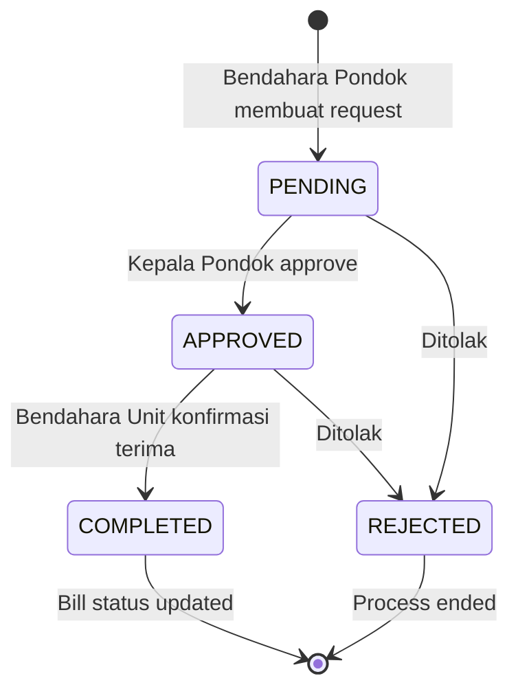

# Manual Settlement

Workflow 3 langkah untuk distribusi dana dari Panitia ke Unit-unit di Pondok Pesantren.

## Konsep Dasar

### Mengapa Manual Settlement?

Pembayaran yang diterima di **Panitia** perlu didistribusikan ke unit-unit lembaga. Proses ini memerlukan:

1. **Audit Trail** - Siapa yang membuat, menyetujui, dan menerima
2. **Approval Chain** - Mencegah distribusi tanpa persetujuan
3. **Confirmation** - Memastikan dana benar-benar diterima

## Status Workflow

```
      STEP 1               STEP 2               STEP 3
  ┌───────────┐        ┌───────────┐        ┌───────────┐
  │  PENDING  │───────▶│ APPROVED  │───────▶│ COMPLETED │
  └───────────┘        └───────────┘        └───────────┘
       │                    │                    │
    Bendahara           Kepala              Bendahara
     Pondok             Pondok                Unit
       │                    │                    │
    "Saya minta         "Saya setuju         "Saya sudah
    distribusi ini"    untuk distribusi"    terima dananya"
```

### Status REJECTED

```
  ┌───────────┐        ┌───────────┐
  │  PENDING  │───────▶│ REJECTED  │
  └───────────┘        └───────────┘
       │                    │
    Dibuat              Ditolak
                       oleh siapapun
                       yang berwenang
```

## Detail Setiap Langkah

### Step 1: PENDING (Request Dibuat)

| Aspek | Detail |
|-------|--------|
| **Dibuat oleh** | Bendahara Pondok / Administrator |
| **Aksi** | Membuat permintaan distribusi |
| **Data yang disimpan** | `user_id`, `amount`, `transfer_date`, `transfer_method` |
| **Menunggu** | Approval dari Kepala |

**Kapan dibuat:**
- Manual via "Buat Distribusi Baru" di FundTransfer Resource
- Berdasarkan hasil perhitungan **Priority Algorithm**

### Step 2: APPROVED (Disetujui Kepala)

| Aspek | Detail |
|-------|--------|
| **Disetujui oleh** | Kepala Pondok |
| **Aksi** | Menekan tombol "Approve" |
| **Data yang disimpan** | `approved_at`, `approved_by` |
| **Menunggu** | Konfirmasi penerimaan oleh Bendahara Unit |

### Step 3: COMPLETED (Dana Diterima)

| Aspek | Detail |
|-------|--------|
| **Dikonfirmasi oleh** | Bendahara Unit tujuan |
| **Aksi** | Menekan tombol "Konfirmasi Terima" |
| **Data yang disimpan** | `received_at`, `received_by` |
| **Efek** | Bill status di-update, `is_settled` menjadi TRUE |

## Role & Permissions Matrix

| Role | Buat Request | Approve | Konfirmasi Terima | Reject |
|------|--------------|---------|-------------------|--------|
| Administrator | ✅ | ✅ | ✅ | ✅ |
| Bendahara Pondok | ✅ | ❌ | ✅ (Pondok only) | ❌ |
| Kepala Pondok | ❌ | ✅ | ❌ | ✅ |
| Bendahara Unit | ❌ | ❌ | ✅ (Own Unit) | ❌ |
| Kepala Unit | ❌ | ❌ | ❌ | ❌ |
| Petugas | ❌ (View Only) | ❌ | ❌ | ❌ |

> [!IMPORTANT]
> - **Approval** hanya bisa dilakukan oleh **Kepala Pondok**
> - **Konfirmasi terima** hanya bisa dilakukan oleh **Bendahara tujuan** (match `institution_id`)

## Implementasi Teknis

### FundTransfer Model

```php
// app/Models/FundTransfer.php

class FundTransfer extends Model
{
    protected $fillable = [
        'institution_id',
        'student_id',
        'bill_id',
        'transaction_id',
        'user_id',           // Creator
        'amount',
        'transfer_date',
        'transfer_method',
        'notes',
        'status',            // PENDING, APPROVED, COMPLETED, REJECTED
        'approved_at',
        'approved_by',
        'received_at',
        'received_by',
    ];

    // Status helper methods
    public function isPending(): bool
    {
        return $this->status === 'PENDING';
    }

    public function isApproved(): bool
    {
        return $this->status === 'APPROVED';
    }

    public function isCompleted(): bool
    {
        return $this->status === 'COMPLETED';
    }

    public function isRejected(): bool
    {
        return $this->status === 'REJECTED';
    }
}
```

### Approve Method

```php
// Step 2: Approval oleh Kepala
public function approve(User $user): void
{
    $this->update([
        'status' => 'APPROVED',
        'approved_at' => now(),
        'approved_by' => $user->id,
    ]);
}
```

### Confirm Receipt Method

```php
// Step 3: Konfirmasi penerimaan oleh Bendahara Unit
public function confirmReceipt(User $user): void
{
    $this->update([
        'status' => 'COMPLETED',
        'received_at' => now(),
        'received_by' => $user->id,
    ]);
}
```

### Reject Method

```php
public function reject(): void
{
    $this->update(['status' => 'REJECTED']);
}
```

### Model Events (Bill Update)

```php
protected static function booted(): void
{
    static::updated(function ($fundTransfer) {
        // Only update bill when status changes to COMPLETED
        if ($fundTransfer->isDirty('status') && 
            $fundTransfer->isCompleted() && 
            $fundTransfer->bill_id) {
            $fundTransfer->bill->updateStatusFromTransfers();
        }
    });

    static::deleted(function ($fundTransfer) {
        if ($fundTransfer->bill_id && $fundTransfer->isCompleted()) {
            $fundTransfer->bill->updateStatusFromTransfers();
        }
    });
}
```

## Alur UI (Filament)

### Membuat Request Baru

1. Buka **FundTransfer Resource** di Admin Panel
2. Klik **"Buat Distribusi Baru"**
3. Pilih **Lembaga Tujuan** (hanya yang punya dana pending)
4. Sistem menampilkan:
   - Dana tersedia (dari Priority Algorithm)
   - Rincian per santri
5. Pilih metode transfer dan tanggal
6. Submit → Status = **PENDING**

### Approval oleh Kepala

1. Kepala Pondok melihat list FundTransfer
2. Filter by status = **PENDING**
3. Klik tombol **"Approve"** pada record
4. Status berubah menjadi **APPROVED**

### Konfirmasi Terima oleh Bendahara Unit

1. Bendahara Unit melihat list FundTransfer
2. Filter by status = **APPROVED** dan institution = miliknya
3. Klik tombol **"Konfirmasi Terima"**
4. Status berubah menjadi **COMPLETED**
5. Bill status ter-update

## Diagram Alur Lengkap



## Data yang Dicatat

### Audit Trail

| Fase | Timestamp Field | User Field |
|------|-----------------|------------|
| Created | `created_at` | `user_id` |
| Approved | `approved_at` | `approved_by` |
| Received | `received_at` | `received_by` |

### Relationships

```php
// Siapa yang membuat request
public function user(): BelongsTo
{
    return $this->belongsTo(User::class);
}

// Siapa yang approve
public function approver(): BelongsTo
{
    return $this->belongsTo(User::class, 'approved_by');
}

// Siapa yang menerima
public function receiver(): BelongsTo
{
    return $this->belongsTo(User::class, 'received_by');
}
```

## Service Methods

### Create Settlement Requests

```php
// app/Services/PaymentDistributionService.php

public function createSettlementRequests(
    Institution $institution,
    User $user,
    string $transferMethod = 'cash',
    ?string $notes = null
): Collection {
    $bulkDistribution = $this->calculateBulkDistribution();
    $institutionData = $bulkDistribution->get($institution->id);
    
    $createdTransfers = collect();
    
    foreach ($institutionData['details'] as $detail) {
        if ($detail['pending'] <= 0) continue;
        
        $transfer = FundTransfer::create([
            'institution_id' => $detail['institution_id'],
            'student_id' => $detail['student_id'],
            'bill_id' => $detail['bill_id'],
            'user_id' => $user->id,
            'amount' => $detail['pending'],
            'transfer_date' => now(),
            'transfer_method' => $transferMethod,
            'notes' => $notes,
            'status' => 'PENDING', // Always starts as PENDING
        ]);
        
        $createdTransfers->push($transfer);
    }
    
    return $createdTransfers;
}
```

### Get Pending Settlement Amount

```php
public function getPendingSettlementAmount(Institution $institution): float
{
    return (float) FundTransfer::where('institution_id', $institution->id)
        ->whereIn('status', ['PENDING', 'APPROVED'])
        ->sum('amount');
}
```

## Referensi File

| File | Deskripsi |
|------|-----------|
| [FundTransfer.php](file:///c:/laragon/www/psb/app/Models/FundTransfer.php) | Model dengan workflow methods |
| [FundTransferResource.php](file:///c:/laragon/www/psb/app/Filament/Resources/FundTransferResource.php) | Filament CRUD resource |
| [ListFundTransfers.php](file:///c:/laragon/www/psb/app/Filament/Resources/FundTransferResource/Pages/ListFundTransfers.php) | Create distribution action |
| [PaymentDistributionService.php](file:///c:/laragon/www/psb/app/Services/PaymentDistributionService.php) | Settlement creation service |

## Lihat Juga

- [Priority Algorithm](file:///c:/laragon/www/psb/docs/PRIORITY_ALGORITHM.md)
- [Hybrid Cash Collection](file:///c:/laragon/www/psb/docs/HYBRID_CASH_COLLECTION.md)
