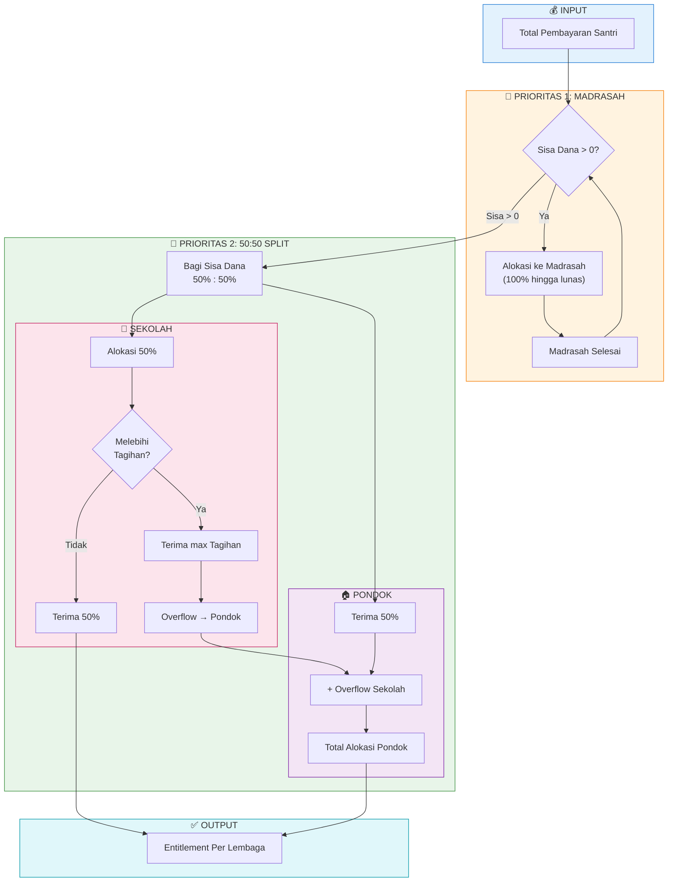

# Priority Algorithm

Algoritma prioritas menentukan pembagian dana dari pembayaran santri ke berbagai lembaga di Pondok Pesantren.

## Konsep Dasar

Ketika santri membayar sebagian dari total tagihannya, sistem harus menentukan **lembaga mana yang mendapat prioritas** untuk menerima dana tersebut. Algoritma ini memastikan distribusi yang adil dan konsisten.

## Urutan Prioritas



## Mekanisme Plafond & Overflow

### Sekolah Plafond

- Sekolah tidak dapat menerima lebih dari total tagihannya
- Jika alokasi 50% melebihi tagihan sekolah, sisanya menjadi **overflow**

### Pondok Overflow

- Pondok menerima:
  - Alokasi 50% standar
  - **Plus** overflow dari sekolah (jika ada)

## Contoh Perhitungan

### Skenario 1: Pembayaran Lengkap

| Komponen | Tagihan |
|----------|---------|
| Madrasah | Rp 290.000 |
| SMP | Rp 2.295.000 |
| Pondok | Rp 4.633.000 |
| **Total** | **Rp 7.218.000** |

**Pembayaran: Rp 7.218.000**

```
1. Madrasah     → Rp 290.000    (100% tagihan)
2. Sisa         = Rp 6.928.000
3. Split 50:50  = Rp 3.464.000 masing-masing
4. SMP          → Rp 2.295.000  (max tagihan)
5. Overflow     = Rp 1.169.000  (ke Pondok)
6. Pondok       → Rp 3.464.000 + Rp 1.169.000 = Rp 4.633.000
```

**Hasil:**
- Madrasah: Rp 290.000 ✓ (Lunas)
- SMP: Rp 2.295.000 ✓ (Lunas)
- Pondok: Rp 4.633.000 ✓ (Lunas)

---

### Skenario 2: Pembayaran Sebagian

| Komponen | Tagihan |
|----------|---------|
| Madrasah | Rp 290.000 |
| SMP | Rp 2.295.000 |
| Pondok | Rp 4.633.000 |
| **Total** | **Rp 7.218.000** |

**Pembayaran: Rp 4.000.000**

```
1. Madrasah     → Rp 290.000    (100% tagihan)
2. Sisa         = Rp 3.710.000
3. Split 50:50  = Rp 1.855.000 masing-masing
4. SMP          → Rp 1.855.000  (< tagihan, tidak ada overflow)
5. Overflow     = Rp 0
6. Pondok       → Rp 1.855.000
```

**Hasil:**
- Madrasah: Rp 290.000 ✓ (Lunas)
- SMP: Rp 1.855.000 (Sisa Rp 440.000)
- Pondok: Rp 1.855.000 (Sisa Rp 2.778.000)

---

### Skenario 3: Pembayaran Sangat Kecil

| Komponen | Tagihan |
|----------|---------|
| Madrasah | Rp 290.000 |
| SMP | Rp 2.295.000 |
| Pondok | Rp 4.633.000 |
| **Total** | **Rp 7.218.000** |

**Pembayaran: Rp 200.000**

```
1. Madrasah     → Rp 200.000  (seluruh uang < tagihan)
2. Sisa         = Rp 0
```

**Hasil:**
- Madrasah: Rp 200.000 (Sisa Rp 90.000)
- SMP: Rp 0
- Pondok: Rp 0

## Implementasi Teknis

### Service Class

```php
// app/Services/PaymentDistributionService.php

public function calculateStudentEntitlement(Student $student): array
{
    $totalPaid = $student->getTotalPaid();
    $bills = $student->bills()->with('institution')->get();
    
    // Group bills by institution type
    $billsByType = $bills->groupBy(fn($bill) => $bill->institution?->type);
    
    // Step 1: Madrasah Priority
    $remainingAmount = $this->allocateEntitlement(
        $billsByType, 'madrasah', $totalPaid, $entitlements
    );
    
    // Step 2: 50:50 Split
    $sekolahTypes = ['smp', 'ma', 'mts'];
    $sekolahBillTotal = $bills->whereIn('institution.type', $sekolahTypes)->sum('amount');
    $halfAmount = $remainingAmount / 2;
    
    // Sekolah allocation with plafond
    $sekolahAllocation = min($halfAmount, $sekolahBillTotal);
    $sekolahOverflow = $halfAmount - $sekolahAllocation;
    
    // Pondok gets its half + overflow
    $pondokAllocation = $halfAmount + $sekolahOverflow;
    
    // ... allocate to institutions
}
```

### Catatan Penting

1. **Entitlement bersifat FIXED** - Tidak berubah setelah transfer dilakukan
2. **Pending = Entitlement - Transferred** - Yang belum didistribusikan
3. Algoritma dijalankan setiap kali menghitung distribusi

## Referensi File

| File | Deskripsi |
|------|-----------|
| [PaymentDistributionService.php](file:///c:/laragon/www/psb/app/Services/PaymentDistributionService.php) | Implementasi algoritma |
| [Bill.php](file:///c:/laragon/www/psb/app/Models/Bill.php) | Model tagihan |
| [Student.php](file:///c:/laragon/www/psb/app/Models/Student.php) | Method `getTotalPaid()` |

## Lihat Juga

- [Hybrid Cash Collection](file:///c:/laragon/www/psb/docs/HYBRID_CASH_COLLECTION.md)
- [Manual Settlement](file:///c:/laragon/www/psb/docs/MANUAL_SETTLEMENT.md)
