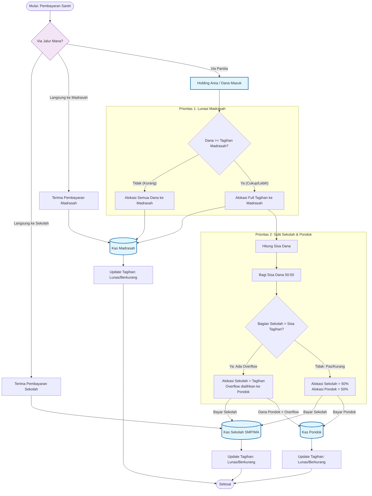

# Priority Algorithm

Algoritma prioritas menentukan pembagian dana dari pembayaran santri ke berbagai lembaga di Pondok Pesantren.

## Kapan Algoritma Digunakan?

> [!IMPORTANT]
> - Algoritma prioritas **HANYA berlaku** untuk pembayaran di **PANITIA**
> - Pembayaran langsung ke **Madrasah/Sekolah** mengurangi **sisa tagihan**
> - Priority Algorithm menghitung berdasarkan **sisa tagihan** (setelah pembayaran langsung)

## Diagram Alur Lengkap



## Lokasi Input Pembayaran

| Lokasi | Role | Algoritma | Efek |
|--------|------|-----------|------|
| **Panitia** | Admin, Petugas, Bd. Pondok | ✅ Aktif | Distribusi via algoritma ke sisa tagihan |
| **Madrasah** | Bendahara Madrasah | ❌ Tidak | Langsung kurangi tagihan Madrasah |
| **Sekolah** | Bendahara SMP/MA | ❌ Tidak | Langsung kurangi tagihan Sekolah |

---

## Cara Kerja Priority Algorithm

### Langkah 1: Hitung Sisa Tagihan

Sebelum algoritma berjalan, sistem menghitung **sisa tagihan** yang belum dibayar:

```
Sisa Tagihan Madrasah = Tagihan Madrasah - Pembayaran Langsung ke Madrasah
Sisa Tagihan Sekolah  = Tagihan Sekolah  - Pembayaran Langsung ke Sekolah
Sisa Tagihan Pondok   = Tagihan Pondok   - Pembayaran Langsung ke Pondok
```

### Langkah 2: Distribusi Dana Panitia

Dana dari Panitia didistribusikan berdasarkan **sisa tagihan**:

1. **Prioritas 1: MADRASAH** - Alokasi 100% ke sisa tagihan Madrasah
2. **Prioritas 2: 50:50 SPLIT** - Sisa dana dibagi ke Sekolah dan Pondok
   - Sekolah maksimal menerima sebesar sisa tagihannya
   - Overflow dari Sekolah masuk ke Pondok

## Pembayaran Langsung ke Unit

### Di Madrasah

Ketika **Bendahara Unit Madrasah** menerima pembayaran:

```
Pembayaran: Rp 500.000
→ Langsung masuk ke tagihan Madrasah
→ Tidak mempengaruhi tagihan Sekolah/Pondok
```

**Hasil:**
- Madrasah: Rp 500.000 ✓
- Sekolah: Rp 0
- Pondok: Rp 0

### Di Sekolah (SMP/MA)

Ketika **Bendahara Unit SMP** atau **Bendahara Unit MA** menerima pembayaran:

```
Pembayaran: Rp 1.000.000
→ Langsung masuk ke tagihan Sekolah (SMP atau MA)
→ Tidak mempengaruhi tagihan Madrasah/Pondok
```

**Hasil:**
- Madrasah: Rp 0
- Sekolah: Rp 1.000.000 ✓
- Pondok: Rp 0

---

## Contoh Perhitungan (Pembayaran di Panitia)

### Tagihan Santri

| Komponen | Tagihan |
|----------|---------|
| Madrasah | Rp 290.000 |
| SMP | Rp 2.295.000 |
| Pondok | Rp 4.633.000 |
| **Total** | **Rp 7.218.000** |

### Skenario 1: Pembayaran Lengkap

**Pembayaran: Rp 7.218.000** (di Panitia)

```
1. Madrasah     → Rp 290.000    (100% tagihan)
2. Sisa         = Rp 6.928.000
3. Split 50:50  = Rp 3.464.000 masing-masing
4. SMP          → Rp 2.295.000  (max tagihan)
5. Overflow     = Rp 1.169.000  (ke Pondok)
6. Pondok       → Rp 3.464.000 + Rp 1.169.000 = Rp 4.633.000
```

**Hasil:**
- Madrasah: Rp 290.000 ✓ (Lunas)
- SMP: Rp 2.295.000 ✓ (Lunas)
- Pondok: Rp 4.633.000 ✓ (Lunas)

---

### Skenario 2: Pembayaran Sebagian

**Pembayaran: Rp 4.000.000** (di Panitia)

```
1. Madrasah     → Rp 290.000    (100% tagihan)
2. Sisa         = Rp 3.710.000
3. Split 50:50  = Rp 1.855.000 masing-masing
4. SMP          → Rp 1.855.000  (< tagihan, tidak ada overflow)
5. Overflow     = Rp 0
6. Pondok       → Rp 1.855.000
```

**Hasil:**
- Madrasah: Rp 290.000 ✓ (Lunas)
- SMP: Rp 1.855.000 (Sisa Rp 440.000)
- Pondok: Rp 1.855.000 (Sisa Rp 2.778.000)

---

### Skenario 3: Pembayaran Sangat Kecil

**Pembayaran: Rp 200.000** (di Panitia)

```
1. Madrasah     → Rp 200.000  (seluruh uang < tagihan)
2. Sisa         = Rp 0
```

**Hasil:**
- Madrasah: Rp 200.000 (Sisa Rp 90.000)
- SMP: Rp 0
- Pondok: Rp 0

---

## Kombinasi Pembayaran

Santri bisa membayar di **berbagai lokasi** secara bersamaan:

| Pembayaran | Lokasi | Hasil |
|------------|--------|-------|
| Rp 290.000 | Madrasah | → Langsung ke Madrasah |
| Rp 500.000 | SMP | → Langsung ke SMP |
| Rp 2.000.000 | Panitia | → Via algoritma (Madrasah → 50:50) |

Sistem akan menghitung total penerimaan dari semua sumber.

---

## Referensi File

| File | Deskripsi |
|------|-----------|
| [PaymentDistributionService.php](file:///c:/laragon/www/psb/app/Services/PaymentDistributionService.php) | Implementasi algoritma |
| [Bill.php](file:///c:/laragon/www/psb/app/Models/Bill.php) | Model tagihan |
| [Student.php](file:///c:/laragon/www/psb/app/Models/Student.php) | Method `getTotalPaid()` |

## Lihat Juga

- [Hybrid Cash Collection](file:///c:/laragon/www/psb/docs/HYBRID_CASH_COLLECTION.md)
- [Manual Settlement](file:///c:/laragon/www/psb/docs/MANUAL_SETTLEMENT.md)
