# Priority Algorithm

Algoritma prioritas menentukan pembagian dana dari pembayaran santri ke berbagai lembaga di Pondok Pesantren.

## Kapan Algoritma Digunakan?

> [!IMPORTANT]
> Algoritma prioritas **HANYA berlaku** untuk pembayaran yang diterima di **PANITIA**.
> Pembayaran langsung ke unit (Madrasah/Sekolah) **TIDAK menggunakan** algoritma ini.

```mermaid
flowchart TD
    subgraph INPUT["💰 PEMBAYARAN MASUK"]
        A{"Di mana pembayaran<br/>diterima?"}
    end

    subgraph PANITIA["🏛️ PANITIA"]
        B["Admin / Petugas / Bendahara Pondok"]
        C["✅ Priority Algorithm AKTIF"]
        D["Dana didistribusikan sesuai prioritas"]
    end

    subgraph MADRASAH["📿 MADRASAH"]
        E["Bendahara Unit Madrasah"]
        F["❌ Priority Algorithm TIDAK AKTIF"]
        G["Dana langsung masuk ke Madrasah"]
    end

    subgraph SEKOLAH["🏫 SEKOLAH"]
        H["Bendahara Unit SMP/MA"]
        I["❌ Priority Algorithm TIDAK AKTIF"]
        J["Dana langsung masuk ke Sekolah"]
    end

    A -->|Panitia| B
    A -->|Madrasah| E
    A -->|Sekolah| H
    
    B --> C --> D
    E --> F --> G
    H --> I --> J

    style PANITIA fill:#e3f2fd,stroke:#1976d2
    style MADRASAH fill:#fff3e0,stroke:#f57c00
    style SEKOLAH fill:#e8f5e9,stroke:#388e3c
```



## Lokasi Input Pembayaran

| Lokasi | Role yang Bisa Input | Algoritma Prioritas | Alokasi Dana |
|--------|---------------------|---------------------|--------------|
| **Panitia** | Administrator, Petugas, Bendahara Pondok | ✅ Aktif | Didistribusikan via algoritma |
| **Madrasah** | Bendahara Unit (Madrasah) | ❌ Tidak Aktif | Langsung ke Madrasah |
| **Sekolah** | Bendahara Unit (SMP/MA) | ❌ Tidak Aktif | Langsung ke Sekolah |

---

## Algoritma Prioritas (Hanya untuk Panitia)

### Urutan Prioritas

```mermaid
flowchart TD
    subgraph INPUT["💰 INPUT (dari Panitia)"]
        A["Total Pembayaran Santri"]
    end

    subgraph PRIORITY1["🥇 PRIORITAS 1: MADRASAH"]
        B{"Sisa Dana > 0?"}
        C["Alokasi ke Madrasah<br/>(100% hingga lunas)"]
        D["Madrasah Selesai"]
    end

    subgraph PRIORITY2["🥈 PRIORITAS 2: 50:50 SPLIT"]
        E["Bagi Sisa Dana<br/>50% : 50%"]
        
        subgraph SEKOLAH_SPLIT["🏫 SEKOLAH"]
            F["Alokasi 50%"]
            G{"Melebihi<br/>Tagihan?"}
            H["Terima max Tagihan"]
            I["Terima 50%"]
            J["Overflow → Pondok"]
        end
        
        subgraph PONDOK["🏠 PONDOK"]
            K["Terima 50%"]
            L["+ Overflow Sekolah"]
            M["Total Alokasi Pondok"]
        end
    end

    subgraph OUTPUT["✅ OUTPUT"]
        N["Entitlement Per Lembaga"]
    end

    A --> B
    B -->|Ya| C
    C --> D
    D --> B
    B -->|"Sisa > 0"| E
    
    E --> F
    F --> G
    G -->|Ya| H
    G -->|Tidak| I
    H --> J
    J --> L
    I --> N
    
    E --> K
    K --> L
    L --> M
    M --> N

    style INPUT fill:#e3f2fd,stroke:#1976d2
    style PRIORITY1 fill:#fff3e0,stroke:#f57c00
    style PRIORITY2 fill:#e8f5e9,stroke:#388e3c
    style SEKOLAH_SPLIT fill:#fce4ec,stroke:#c2185b
    style PONDOK fill:#f3e5f5,stroke:#7b1fa2
    style OUTPUT fill:#e0f7fa,stroke:#0097a7
```



### Ringkasan Algoritma

1. **Prioritas 1: MADRASAH** - Madrasah mendapat 100% dana hingga tagihan lunas
2. **Prioritas 2: 50:50 SPLIT** - Sisa dana dibagi antara Sekolah dan Pondok
   - Sekolah tidak bisa menerima lebih dari tagihannya (plafond)
   - Overflow dari Sekolah masuk ke Pondok

---

## Pembayaran Langsung ke Unit

### Di Madrasah

Ketika **Bendahara Unit Madrasah** menerima pembayaran:

```
Pembayaran: Rp 500.000
→ Langsung masuk ke tagihan Madrasah
→ Tidak mempengaruhi tagihan Sekolah/Pondok
```

**Hasil:**
- Madrasah: Rp 500.000 ✓
- Sekolah: Rp 0
- Pondok: Rp 0

### Di Sekolah (SMP/MA)

Ketika **Bendahara Unit SMP** atau **Bendahara Unit MA** menerima pembayaran:

```
Pembayaran: Rp 1.000.000
→ Langsung masuk ke tagihan Sekolah (SMP atau MA)
→ Tidak mempengaruhi tagihan Madrasah/Pondok
```

**Hasil:**
- Madrasah: Rp 0
- Sekolah: Rp 1.000.000 ✓
- Pondok: Rp 0

---

## Contoh Perhitungan (Pembayaran di Panitia)

### Tagihan Santri

| Komponen | Tagihan |
|----------|---------|
| Madrasah | Rp 290.000 |
| SMP | Rp 2.295.000 |
| Pondok | Rp 4.633.000 |
| **Total** | **Rp 7.218.000** |

### Skenario 1: Pembayaran Lengkap

**Pembayaran: Rp 7.218.000** (di Panitia)

```
1. Madrasah     → Rp 290.000    (100% tagihan)
2. Sisa         = Rp 6.928.000
3. Split 50:50  = Rp 3.464.000 masing-masing
4. SMP          → Rp 2.295.000  (max tagihan)
5. Overflow     = Rp 1.169.000  (ke Pondok)
6. Pondok       → Rp 3.464.000 + Rp 1.169.000 = Rp 4.633.000
```

**Hasil:**
- Madrasah: Rp 290.000 ✓ (Lunas)
- SMP: Rp 2.295.000 ✓ (Lunas)
- Pondok: Rp 4.633.000 ✓ (Lunas)

---

### Skenario 2: Pembayaran Sebagian

**Pembayaran: Rp 4.000.000** (di Panitia)

```
1. Madrasah     → Rp 290.000    (100% tagihan)
2. Sisa         = Rp 3.710.000
3. Split 50:50  = Rp 1.855.000 masing-masing
4. SMP          → Rp 1.855.000  (< tagihan, tidak ada overflow)
5. Overflow     = Rp 0
6. Pondok       → Rp 1.855.000
```

**Hasil:**
- Madrasah: Rp 290.000 ✓ (Lunas)
- SMP: Rp 1.855.000 (Sisa Rp 440.000)
- Pondok: Rp 1.855.000 (Sisa Rp 2.778.000)

---

### Skenario 3: Pembayaran Sangat Kecil

**Pembayaran: Rp 200.000** (di Panitia)

```
1. Madrasah     → Rp 200.000  (seluruh uang < tagihan)
2. Sisa         = Rp 0
```

**Hasil:**
- Madrasah: Rp 200.000 (Sisa Rp 90.000)
- SMP: Rp 0
- Pondok: Rp 0

---

## Kombinasi Pembayaran

Santri bisa membayar di **berbagai lokasi** secara bersamaan:

| Pembayaran | Lokasi | Hasil |
|------------|--------|-------|
| Rp 290.000 | Madrasah | → Langsung ke Madrasah |
| Rp 500.000 | SMP | → Langsung ke SMP |
| Rp 2.000.000 | Panitia | → Via algoritma (Madrasah → 50:50) |

Sistem akan menghitung total penerimaan dari semua sumber.

---

## Referensi File

| File | Deskripsi |
|------|-----------|
| [PaymentDistributionService.php](file:///c:/laragon/www/psb/app/Services/PaymentDistributionService.php) | Implementasi algoritma |
| [Bill.php](file:///c:/laragon/www/psb/app/Models/Bill.php) | Model tagihan |
| [Student.php](file:///c:/laragon/www/psb/app/Models/Student.php) | Method `getTotalPaid()` |

## Lihat Juga

- [Hybrid Cash Collection](file:///c:/laragon/www/psb/docs/HYBRID_CASH_COLLECTION.md)
- [Manual Settlement](file:///c:/laragon/www/psb/docs/MANUAL_SETTLEMENT.md)
