# Panduan Pendaftaran Santri Baru

Dokumentasi alur pendaftaran santri baru di Pondok Pesantren.

## Persyaratan Pendaftaran

### Dokumen Wajib

| Dokumen | Keterangan |
|---------|------------|
| **Kartu Keluarga (KK)** | Scan/foto yang jelas |
| **Akta Kelahiran** | Scan/foto yang jelas |

### Dokumen Opsional

| Dokumen | Keterangan |
|---------|------------|
| KTP Ayah | Jika ada |
| KTP Ibu | Jika ada |
| KTP Wali | Jika wali bukan ayah/ibu |
| Ijazah/SKHUN | Ijazah terakhir |
| Kartu NISN | Jika sudah punya |
| Kartu KIP | Jika penerima KIP |

> [!IMPORTANT]
> Ukuran file maksimal **2MB** per dokumen.
> Format yang diterima: **JPG, PNG, PDF**

### Informasi yang Perlu Disiapkan

**Data Santri:**
- NIK (16 digit)
- NISN (opsional, 10 digit)
- Tempat & Tanggal Lahir
- Alamat lengkap (Provinsi, Kabupaten, Kecamatan, Desa)

**Data Orang Tua/Wali:**
- Nama lengkap Ayah & Ibu
- NIK Orang Tua
- Pendidikan terakhir
- Pekerjaan & Penghasilan
- **Nomor WhatsApp** (minimal satu yang aktif)

**Data Sekolah:**
- Nama sekolah asal
- Alamat sekolah asal
- Pilihan jenjang tujuan (SMP/MA)

---

## Alur Pendaftaran

```mermaid
flowchart TD
    subgraph STEP1["📝 LANGKAH 1: Data Santri"]
        A["Isi biodata calon santri"]
        A1["NIK, NISN, TTL"]
        A2["Alamat lengkap"]
    end

    subgraph STEP2["👨‍👩‍👦 LANGKAH 2: Data Orang Tua"]
        B["Isi data Ayah & Ibu"]
        B1["Pendidikan, Pekerjaan"]
        B2["Nomor WhatsApp"]
        B3["Pilih Wali: Ayah/Ibu/Lainnya"]
    end

    subgraph STEP3["🏫 LANGKAH 3: Pilihan Sekolah"]
        C["Isi asal sekolah"]
        C1["Pilih tujuan: SMP/MA"]
        C2["Pilih kelas"]
        C3["Lihat estimasi biaya"]
    end

    subgraph STEP4["📎 LANGKAH 4: Upload Dokumen"]
        D["Upload KK & Akta"]
        D1["Upload dokumen lainnya"]
    end

    subgraph STEP5["✅ LANGKAH 5: Konfirmasi"]
        E["Review semua data"]
        E1["Submit pendaftaran"]
    end

    subgraph SUCCESS["🎉 BERHASIL"]
        F["Dapat Nomor Registrasi"]
        F1["WhatsApp konfirmasi dikirim"]
        F2["Tagihan otomatis dibuat"]
    end

    A --> A1 --> A2
    STEP1 --> STEP2
    B --> B1 --> B2 --> B3
    STEP2 --> STEP3
    C --> C1 --> C2 --> C3
    STEP3 --> STEP4
    D --> D1
    STEP4 --> STEP5
    E --> E1
    STEP5 --> SUCCESS
    F --> F1 --> F2

    style STEP1 fill:#e3f2fd,stroke:#1976d2
    style STEP2 fill:#fff3e0,stroke:#f57c00  
    style STEP3 fill:#e8f5e9,stroke:#388e3c
    style STEP4 fill:#fce4ec,stroke:#c2185b
    style STEP5 fill:#f3e5f5,stroke:#7b1fa2
    style SUCCESS fill:#c8e6c9,stroke:#2e7d32
```

---

## Detail Setiap Langkah

### Langkah 1: Data Santri

Isi biodata lengkap calon santri.

| Field | Wajib | Keterangan |
|-------|-------|------------|
| Nama Lengkap | ✅ | Sesuai akta kelahiran |
| NIK | ✅ | 16 digit, dari KK |
| NISN | ❌ | 10 digit jika sudah punya |
| Tempat Lahir | ✅ | Sesuai akta |
| Tanggal Lahir | ✅ | Format: DD/MM/YYYY |
| Jenis Kelamin | ✅ | Laki-laki / Perempuan |
| Anak ke- | ✅ | Urutan dalam keluarga |
| Dari ... bersaudara | ✅ | Total saudara kandung |
| Provinsi | ✅ | Pilih dari dropdown |
| Kabupaten/Kota | ✅ | Pilih dari dropdown |
| Kecamatan | ✅ | Pilih dari dropdown |
| Desa/Kelurahan | ✅ | Pilih dari dropdown |
| Alamat Jalan | ✅ | Detail alamat (RT/RW, dll) |
| Kode Pos | ❌ | Opsional |

### Langkah 2: Data Orang Tua / Wali

Isi data ayah, ibu, dan tentukan wali.

**Data Ayah:**
| Field | Wajib | Keterangan |
|-------|-------|------------|
| Nama Ayah | ✅ | |
| Status | ✅ | Hidup / Meninggal |
| NIK | ❌ | 16 digit |
| Tempat & Tanggal Lahir | ❌ | |
| Pendidikan Terakhir | ❌ | SD s/d S3 |
| Riwayat Pesantren | ❌ | Pernah mondok? Di mana? |
| Pekerjaan | ❌ | Pilih dari daftar |
| Penghasilan | ❌ | Range per bulan |
| No. WhatsApp | ⚠️ | **Wajib minimal 1 WA aktif** |

**Data Ibu:** (sama seperti data Ayah)

**Pilihan Wali:**
- Ayah (default)
- Ibu
- Wali Lain (isi data wali tambahan)

> [!NOTE]
> **Minimal satu nomor WhatsApp harus aktif** (Ayah, Ibu, atau Wali) untuk menerima informasi pendaftaran.

### Langkah 3: Pilihan Sekolah

Pilih jenjang sekolah tujuan.

**Asal Sekolah:**
| Field | Wajib |
|-------|-------|
| Jenjang Asal | ✅ |
| Nama Sekolah | ✅ |
| NPSN Sekolah | ❌ |
| Alamat Sekolah | ✅ |

**Tujuan Pendaftaran:**
| Field | Wajib |
|-------|-------|
| Lembaga Tujuan | ✅ |
| Kelas | ✅ (untuk SMP/MA) |
| Sumber Biaya | ✅ |

**Pilihan Lembaga:**
- **SMP** - Kelas 7, 8, atau 9
- **MA** - Kelas 10, 11, atau 12
- **MTs Eksternal** - Untuk santri yang sekolah di MTs luar

> [!TIP]
> Setelah memilih lembaga, sistem akan menampilkan **estimasi biaya pendidikan**.

### Langkah 4: Upload Dokumen

Upload dokumen persyaratan.

| Dokumen | Wajib | Max Size |
|---------|-------|----------|
| Kartu Keluarga | ✅ | 2 MB |
| Akta Kelahiran | ✅ | 2 MB |
| KTP Ayah | ❌ | 2 MB |
| KTP Ibu | ❌ | 2 MB |
| KTP Wali | ❌ | 2 MB |
| Ijazah/SKHUN | ❌ | 2 MB |
| Kartu NISN | ❌ | 2 MB |
| Kartu KIP | ❌ | 2 MB |

> [!WARNING]
> Pastikan dokumen **terbaca jelas** dan **tidak blur**.

### Langkah 5: Konfirmasi

Review semua data yang telah diisi.
- Periksa kembali semua informasi
- Jika ada kesalahan, klik tombol **Kembali**
- Jika sudah benar, klik tombol **Daftar Sekarang**

---

## Setelah Pendaftaran Berhasil

### Yang Anda Dapatkan

1. **Nomor Registrasi** - Simpan nomor ini untuk cek status
2. **WhatsApp Konfirmasi** - Pesan otomatis ke nomor yang terdaftar
3. **Tagihan Otomatis** - Sistem membuat tagihan sesuai pilihan lembaga

### Komponen Biaya

Tagihan otomatis dibuat untuk:
- **Pondok** - Biaya asrama & kegiatan pondok
- **Madrasah Diniyah** - Biaya pendidikan agama
- **Sekolah Formal** - Biaya SMP/MA (sesuai pilihan)

### Cek Status Pendaftaran

Gunakan fitur **Cek Status** di halaman utama:
1. Masukkan **NIK** atau **Nomor Registrasi**
2. Lihat status pendaftaran
3. Lihat rincian tagihan
4. Lihat dokumen yang sudah diupload

---

## Pertanyaan Umum (FAQ)

### Bagaimana jika salah input data?

Hubungi panitia PSB untuk koreksi data. Beberapa data bisa diubah oleh admin.

### Berapa lama proses verifikasi?

Verifikasi dokumen biasanya memakan waktu **1-3 hari kerja**.

### Bagaimana cara bayar tagihan?

Setelah pendaftaran diverifikasi, Anda bisa melakukan pembayaran:
- Langsung ke **Panitia PSB** (tunai/transfer)
- Langsung ke **Bendahara Unit** terkait

### Apakah bisa daftar ulang jika ditolak?

Ya, perbaiki dokumen yang kurang dan daftar ulang dengan NIK yang sama setelah data lama dihapus oleh admin.

---

## Kontak Panitia

Jika mengalami kendala saat pendaftaran, hubungi:

| Kontak | Keterangan |
|--------|------------|
| WhatsApp | Nomor WA Panitia PSB |
| Email | Email Pondok |
| Telepon | Nomor telepon Pondok |

---

## Referensi Teknis

Untuk dokumentasi teknis sistem pendaftaran, lihat:
- [Kode Registrasi Wizard](file:///c:/laragon/www/psb/app/Livewire/RegistrationWizard.php)
- [Model Registration](file:///c:/laragon/www/psb/app/Models/Registration.php)
- [View Wizard](file:///c:/laragon/www/psb/resources/views/livewire/registration-wizard.blade.php)
