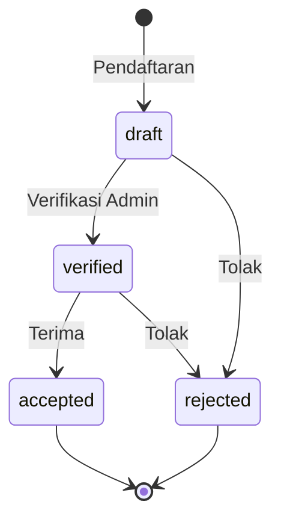

# Status & Workflows

> Dokumentasi lengkap tentang status entitas dan alur kerja aplikasi.

**Dokumentasi Terkait:**
- [← Kembali ke README](../README.md)
- [Database Schema](./DATABASE_SCHEMA.md)
- [Sistem Keuangan](./FINANCIAL_SYSTEM.md)

---

## Status Santri

### Enum Values

| Status | Deskripsi | Warna |
|--------|-----------|-------|
| `draft` | Pendaftaran baru, belum diverifikasi | 🟡 Yellow |
| `verified` | Data sudah diverifikasi admin | 🔵 Blue |
| `accepted` | Diterima sebagai santri | 🟢 Green |
| `rejected` | Ditolak | 🔴 Red |

### State Diagram



### Trigger Actions

| From | To | Trigger | Actor |
|------|----|---------| ------|
| - | `draft` | Submit form pendaftaran | Wali Santri |
| `draft` | `verified` | Klik "Verifikasi" | Admin/Petugas |
| `draft` | `rejected` | Klik "Tolak" | Admin/Petugas |
| `verified` | `accepted` | Klik "Terima" | Admin |
| `verified` | `rejected` | Klik "Tolak" | Admin |

### Implementation

```php
// app/Models/Student.php
protected $casts = [
    'status' => 'string', // draft, verified, accepted, rejected
];

// Bulk action di StudentResource
Tables\Actions\BulkAction::make('verify')
    ->action(fn (Collection $records) => 
        $records->each->update(['status' => 'verified'])
    );
```

---

## Status Tagihan (Bills)

### Enum Values

| Status | Deskripsi | Warna |
|--------|-----------|-------|
| `unpaid` | Belum ada pembayaran | 🔴 Red |
| `partial` | Sudah bayar sebagian | 🟡 Yellow |
| `paid` | Lunas | 🟢 Green |

### Logic

```php
// app/Models/Bill.php
public function applyPayment(float $amount): void
{
    $this->remaining_amount -= $amount;
    
    if ($this->remaining_amount <= 0) {
        $this->remaining_amount = 0;
        $this->status = 'paid';
    } else {
        $this->status = 'partial';
    }
    
    $this->save();
}
```

### State Transitions

```
unpaid ──(bayar sebagian)──> partial ──(lunas)──> paid
   │                                                │
   └────────────(bayar lunas langsung)──────────────┘
```

---

## Status Dokumen

### Enum Values

| Status | Deskripsi | Warna |
|--------|-----------|-------|
| `pending` | Menunggu verifikasi | 🟡 Yellow |
| `valid` | Dokumen valid | 🟢 Green |
| `invalid` | Dokumen tidak valid | 🔴 Red |

### Document Types

| Type | Deskripsi | Required |
|------|-----------|----------|
| `foto` | Foto santri | ✅ |
| `kk` | Kartu Keluarga | ✅ |
| `akta` | Akta Kelahiran | ✅ |
| `ijazah` | Ijazah/SKL | ✅ |

---

## Status Distribusi Dana (Fund Transfers)

### Enum Values

| Status | Deskripsi | Warna |
|--------|-----------|-------|
| `PENDING` | Menunggu approval | 🟡 Yellow |
| `APPROVED` | Disetujui, menunggu penerimaan | 🔵 Blue |
| `COMPLETED` | Dana sudah diterima | 🟢 Green |
| `REJECTED` | Ditolak | 🔴 Red |

### Settlement Workflow (3 Langkah)

```
STEP 1            STEP 2           STEP 3
┌────────┐       ┌────────┐       ┌─────────┐
│PENDING │──────▶│APPROVED│──────▶│COMPLETED│
└────────┘       └────────┘       └─────────┘
     │                                  ▲
     │           ┌────────┐             │
     └──────────▶│REJECTED│─────────────┘
                 └────────┘            (tidak)
```

### Role Responsibilities

| Step | Status | Action | Actor |
|------|--------|--------|-------|
| 1 | Create | Buat request distribusi | Bendahara Pondok |
| 2 | PENDING → APPROVED | Approve | Kepala Pondok |
| 2 | PENDING → REJECTED | Reject | Kepala Pondok |
| 3 | APPROVED → COMPLETED | Konfirmasi terima | Bendahara Unit (tujuan) |

### Implementation

```php
// app/Models/FundTransfer.php

public function approve(User $user): void
{
    $this->status = 'APPROVED';
    $this->approved_at = now();
    $this->approved_by = $user->id;
    $this->save();
}

public function confirmReceipt(User $user): void
{
    $this->status = 'COMPLETED';
    $this->received_at = now();
    $this->received_by = $user->id;
    $this->save();
    
    // Mark related transaction as settled
    $this->transaction?->markAsSettled();
}

public function reject(): void
{
    $this->status = 'REJECTED';
    $this->save();
}
```

---

## Alur Kerja Pendaftaran

### Flow Diagram

```
┌──────────────────────────────────────────────────────────────────┐
│                         WALI SANTRI                              │
└───────────────────────────────┬──────────────────────────────────┘
                                │
                                ▼
                    ┌───────────────────────┐
                    │   Akses /daftar       │
                    │   (RegistrationWizard)│
                    └───────────────────────┘
                                │
                    ┌───────────┴───────────┐
                    │   Isi Form 5 Step:    │
                    │   1. Biodata Santri   │
                    │   2. Data Orang Tua   │
                    │   3. Data Pendaftaran │
                    │   4. Upload Dokumen   │
                    │   5. Konfirmasi       │
                    └───────────┬───────────┘
                                │
                                ▼
                    ┌───────────────────────┐
                    │   Submit Form         │
                    │   status = 'draft'    │
                    └───────────┬───────────┘
                                │
              ┌─────────────────┼─────────────────┐
              │                 │                 │
              ▼                 ▼                 ▼
    ┌─────────────────┐ ┌─────────────────┐ ┌─────────────────┐
    │ Generate Bills  │ │ Generate No.Reg │ │ Notifikasi WA   │
    │ (auto)          │ │ (YYXXXX)        │ │ ke Wali         │
    └─────────────────┘ └─────────────────┘ └─────────────────┘
                                │
                                ▼
                    ┌───────────────────────┐
                    │   ADMIN PANEL         │
                    └───────────┬───────────┘
                                │
              ┌─────────────────┼─────────────────┐
              │                 │                 │
              ▼                 ▼                 ▼
    ┌─────────────────┐ ┌─────────────────┐ ┌─────────────────┐
    │ Verifikasi Data │ │ Verifikasi Dok  │ │ Input Pembayaran│
    │ status=verified │ │ doc.status=valid│ │                 │
    └─────────────────┘ └─────────────────┘ └─────────────────┘
                                │
                                ▼
                    ┌───────────────────────┐
                    │   Terima / Tolak      │
                    │   status = accepted   │
                    │   atau rejected       │
                    └───────────────────────┘
```

### Checklist Verifikasi

Admin memverifikasi:
- [ ] Data santri lengkap dan valid
- [ ] Data orang tua lengkap
- [ ] Dokumen terupload dan valid
- [ ] Pembayaran (minimal DP)

---

## Alur Kerja Pembayaran

### Flow Diagram

```
┌────────────────────────────────────────────────────────────────┐
│                      SANTRI/WALI BAYAR                         │
└───────────────────────────────┬────────────────────────────────┘
                                │
             ┌──────────────────┴──────────────────┐
             │                                     │
             ▼                                     ▼
    ┌─────────────────┐                 ┌─────────────────┐
    │ Bayar ke PANITIA│                 │ Bayar ke UNIT   │
    │ (Admin/Bd.Pondok│                 │ (Bd.Unit)       │
    └────────┬────────┘                 └────────┬────────┘
             │                                   │
             ▼                                   ▼
    ┌─────────────────┐                 ┌─────────────────┐
    │payment_location │                 │payment_location │
    │  = PANITIA      │                 │  = UNIT         │
    │is_settled=false │                 │is_settled=true  │
    └────────┬────────┘                 └────────┬────────┘
             │                                   │
             ▼                                   ▼
    ┌─────────────────┐                 ┌─────────────────┐
    │ Kas "Mengendap" │                 │ Auto create     │
    │ di Panitia      │                 │ FundTransfer    │
    │                 │                 │ status=COMPLETED│
    └────────┬────────┘                 └─────────────────┘
             │
             ▼
    ┌─────────────────┐
    │ Buat Distribusi │
    │ (Bd. Pondok)    │
    └────────┬────────┘
             │
             ▼
    ┌─────────────────────────────────────────────────────────┐
    │               3-STEP SETTLEMENT WORKFLOW                 │
    │                                                          │
    │  PENDING ────▶ APPROVED ────▶ COMPLETED                 │
    │  (Bd.Pondok)   (Kpl.Pondok)   (Bd.Unit)                 │
    └─────────────────────────────────────────────────────────┘
```

### Payment Location Logic

```php
// Otomatis ditentukan berdasarkan role
$paymentLocation = match(true) {
    $user->hasRole(['Administrator', 'Bendahara Pondok', 'Petugas']) => 'PANITIA',
    $user->hasRole('Bendahara Unit') => 'UNIT',
    default => 'PANITIA',
};
```

---

## Alur Kerja Distribusi Dana

### Priority Algorithm

```
Total Bayar Santri
    │
    ▼
┌───────────────────────────────┐
│ PRIORITAS 1: MADRASAH (100%)  │
│ Madrasah dapat haknya dulu    │
└───────────────────────────────┘
    │ Sisa
    ▼
┌───────────────────────────────┐
│ PRIORITAS 2: 50:50            │
│ • 50% untuk Sekolah (SMP/MA)  │
│ • 50% untuk Pondok            │
│ • Overflow ke Pondok          │
└───────────────────────────────┘
```

### Contoh Perhitungan

**Input:**
- Total bayar santri: Rp 10.000.000
- Tagihan Madrasah: Rp 290.000
- Tagihan SMP: Rp 2.295.000
- Tagihan Pondok: Rp 4.633.000

**Distribusi:**
1. Madrasah: Rp 290.000 (100% terpenuhi)
2. Sisa: Rp 9.710.000
3. 50:50 split: Rp 4.855.000 masing-masing
4. SMP: Rp 2.295.000 (max = tagihan)
5. Overflow: Rp 2.560.000 ke Pondok
6. Pondok: Rp 4.855.000 + Rp 2.560.000 = Rp 7.415.000

---

## Notifikasi WhatsApp

### Trigger Events

| Event | Pesan | Timing |
|-------|-------|--------|
| Pendaftaran baru | Info nomor pendaftaran | Setelah submit form |
| Pembayaran | Konfirmasi nominal | Setelah input transaksi |
| Status berubah | Info status baru | Setelah admin update |

### Template Pesan

**Pendaftaran:**
```
Assalamu'alaikum Bapak/Ibu,

Pendaftaran santri atas nama {NAMA} telah berhasil.

No. Pendaftaran: {NOREG}
Total Tagihan: Rp {TAGIHAN}

Silakan lakukan pembayaran ke:
Bank Syariah Indonesia (BSI)
No. Rek: 123-456-789
a.n. Pondok Pesantren Dar Al Tauhid

Terima kasih.
```

**Pembayaran:**
```
Assalamu'alaikum Bapak/Ibu,

Pembayaran sebesar Rp {NOMINAL} untuk santri {NAMA} 
telah kami terima.

Sisa tagihan: Rp {SISA}

Terima kasih.
- Panitia PSB Dar Al Tauhid
```

---

*Dokumentasi ini terakhir diperbarui pada: Januari 2026*
