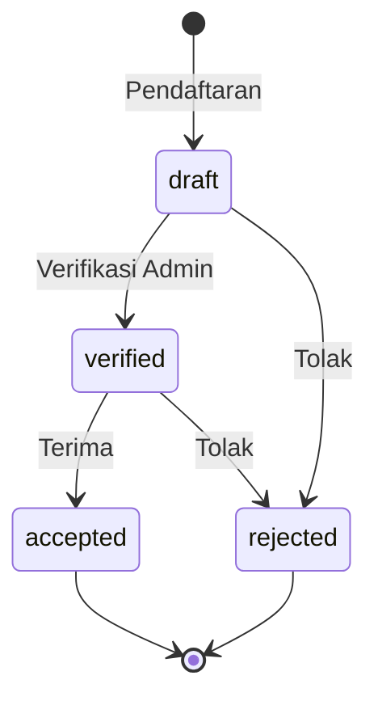

# Dokumentasi Teknis PSB
## Sistem Penerimaan Santri Baru - Pondok Pesantren Dar Al Tauhid

> **Tujuan**: Dokumentasi ini dibuat agar programmer lain (atau Anda di masa depan) bisa memahami alur kode, cara instalasi, dan struktur database.

---

## 📑 Daftar Isi

1. [Instalasi & Konfigurasi](#instalasi--konfigurasi)
2. [Integrasi Pihak Ketiga](#integrasi-pihak-ketiga)
3. [Struktur Database](#struktur-database)
4. [Sistem Keuangan](#sistem-keuangan)
5. [Filament Resources & Widgets](#filament-resources--widgets)
6. [Status & Workflow](#status--workflow)

---

## Instalasi & Konfigurasi

### Prasyarat Sistem

| Komponen | Versi | Keterangan |
|----------|-------|------------|
| **PHP** | `^8.2` | Sesuai `composer.json` |
| **Laravel** | `^12.0` | Framework utama |
| **Filament** | `^4.3` | Admin panel |
| **Livewire** | `^3.7` | Komponen reaktif |
| **MySQL/MariaDB** | 5.7+ / 10.3+ | Database |
| **Node.js** | 18.x+ | Build frontend |

### Ekstensi PHP Wajib
```
BCMath, Ctype, DOM, Fileinfo, JSON, Mbstring, 
OpenSSL, PDO (mysql), Tokenizer, XML, GD/Imagick
```

### Setup File `.env`

```bash
# 1. Copy template
cp .env.example .env

# 2. Edit konfigurasi
```

#### Konfigurasi Database
```env
DB_CONNECTION=mysql
DB_HOST=127.0.0.1
DB_PORT=3306
DB_DATABASE=psb
DB_USERNAME=root
DB_PASSWORD=your_password
```

#### Konfigurasi WhatsApp Gateway (Fonnte)
```env
FONNTE_TOKEN=your_fonnte_api_token
```
> Token didapat dari dashboard [fonnte.com](https://fonnte.com). Disimpan di `.env` dan diakses via `config('services.fonnte.token')`.

#### Konfigurasi Pusher (Realtime Events)
```env
PUSHER_APP_ID="your_app_id"
PUSHER_APP_KEY="your_app_key"
PUSHER_APP_SECRET="your_app_secret"
PUSHER_APP_CLUSTER="ap1"
```

#### Konfigurasi Email SMTP
```env
MAIL_MAILER=smtp
MAIL_HOST=smtp.hostinger.com
MAIL_PORT=465
MAIL_USERNAME=your_email
MAIL_PASSWORD=your_password
MAIL_ENCRYPTION=ssl
MAIL_FROM_ADDRESS="admin@daraltauhid.com"
```

### Perintah Instalasi

```bash
# 1. Clone repository
git clone https://github.com/your-repo/psb.git
cd psb

# 2. Install dependensi PHP
composer install

# 3. Install dependensi Node.js
npm install

# 4. Copy dan konfigurasi .env
cp .env.example .env
# Edit .env sesuai kebutuhan

# 5. Generate application key
php artisan key:generate

# 6. Link storage
php artisan storage:link

# 7. Migrasi database + seeder
php artisan migrate:fresh --seed

# 8. Optimisasi (opsional, untuk production)
php artisan filament:optimize
php artisan config:cache
php artisan route:cache
php artisan view:cache

# 9. Build assets
npm run build
```

### Menjalankan Development Server

```bash
# Cara 1: Script composer (recommended)
composer dev

# Cara 2: Manual
php artisan serve                    # Server
php artisan queue:listen --tries=1   # Queue worker
npm run dev                          # Vite dev server
```

Script `composer dev` menjalankan sekaligus:
- Laravel server (`php artisan serve`)
- Queue worker (`php artisan queue:listen`)
- Log viewer (`php artisan pail`)
- Vite dev server (`npm run dev`)

---

## Integrasi Pihak Ketiga

### 1. Fonnte (WhatsApp Gateway)

**File**: `app/Services/FonnteService.php`

#### Cara Kerja
```
User Action → FonnteService::send() → HTTP POST ke api.fonnte.com → WhatsApp Message
```

#### Konfigurasi Token
```php
// config/services.php
'fonnte' => [
    'token' => env('FONNTE_TOKEN'),
],
```

#### Penggunaan
```php
use App\Services\FonnteService;

$fonnte = new FonnteService();

// Kirim pesan tunggal
$result = $fonnte->send('08123456789', 'Pesan Anda');

// Kirim pesan massal
$results = $fonnte->sendBulk(['08123456789', '08987654321'], 'Pesan broadcast');
```

#### Format Nomor Telepon
Service otomatis mengkonversi format nomor:
- `08123456789` → `628123456789`
- `628123456789` → `628123456789` (tetap)
- Validasi panjang: 10-15 digit

#### Format Response
```php
// Sukses
['success' => true, 'message' => 'Message sent successfully']

// Gagal
['success' => false, 'message' => 'Error reason']
```

#### Penggunaan di Aplikasi
- **Pendaftaran baru**: Notifikasi ke wali santri setelah registrasi
- **Pembayaran**: Notifikasi konfirmasi pembayaran
- **Status update**: Notifikasi perubahan status santri

---

### 2. Wilayah API (Data Provinsi/Kota)

**File**: `app/Services/WilayahService.php`

#### Sumber Data
API publik: `https://wilayah.id/api/`

#### Metode Tersedia
```php
use App\Services\WilayahService;

// Get daftar provinsi
$provinces = WilayahService::getProvinces();
// return: ['11' => 'ACEH', '12' => 'SUMATERA UTARA', ...]

// Get kabupaten/kota berdasarkan provinsi
$regencies = WilayahService::getRegencies('32'); // Jawa Barat
// return: ['3201' => 'KAB. BOGOR', '3202' => 'KAB. SUKABUMI', ...]

// Get kecamatan
$districts = WilayahService::getDistricts('3209'); // Cirebon
// return: ['320901' => 'Waled', '320902' => 'Pasaleman', ...]

// Get desa/kelurahan
$villages = WilayahService::getVillages('320901'); // Waled

// Cari kode berdasarkan nama (untuk form edit)
$provinceCode = WilayahService::findProvinceCode('JAWA BARAT');
```

#### Caching
Data di-cache selama **1 jam** untuk performa:
```php
Cache::remember('api_provinces', 3600, function () { ... });
```

#### Penggunaan di Form
Digunakan di form pendaftaran (RegistrationWizard) untuk cascade dropdown:
```
Provinsi → Kabupaten → Kecamatan → Desa
```

---

## Struktur Database

### Entity Relationship Diagram (ERD)

```mermaid
erDiagram
    students ||--o{ registrations : has
    students ||--o{ student_parents : has
    students ||--o{ student_documents : has
    students ||--o{ bills : has
    students ||--o{ transactions : has
    
    registrations }o--|| institutions : destination
    registrations }o--|| academic_years : belongs_to
    
    bills }o--|| institutions : belongs_to
    
    transactions }o--|| users : input_by
    
    fund_transfers }o--|| institutions : to
    fund_transfers }o--|| students : for
    fund_transfers }o--|| bills : pays
    fund_transfers }o--|| users : created_by
    
    fee_components }o--|| institutions : belongs_to
    fee_components }o--|| academic_years : belongs_to
    
    users }o--|| institutions : belongs_to
```

### Tabel Utama

#### 1. `students` - Data Santri
| Field | Type | Deskripsi |
|-------|------|-----------|
| `id` | bigint | Primary key |
| `registration_number` | varchar | Nomor pendaftaran unik (format: `YYXXXX`) |
| `full_name` | varchar | Nama lengkap |
| `nik` | varchar | NIK (unique) |
| `nisn` | varchar | NISN (optional) |
| `place_of_birth` | varchar | Tempat lahir |
| `date_of_birth` | date | Tanggal lahir |
| `gender` | enum | `male`, `female` |
| `child_number` | int | Anak ke- |
| `total_siblings` | int | Jumlah saudara |
| `address_*` | varchar/text | Alamat lengkap |
| `status` | enum | `draft`, `verified`, `accepted`, `rejected` |

#### 2. `registrations` - Detail Pendaftaran
| Field | Type | Deskripsi |
|-------|------|-----------|
| `student_id` | FK | Relasi ke students |
| `academic_year_id` | FK | Tahun ajaran |
| `previous_school_*` | varchar | Data sekolah asal |
| `destination_institution_id` | FK | Lembaga tujuan (SMP/MA) |
| `destination_class` | varchar | Kelas tujuan |
| `funding_source` | varchar | Sumber biaya |

#### 3. `student_parents` - Data Orang Tua
| Field | Type | Deskripsi |
|-------|------|-----------|
| `student_id` | FK | Relasi ke students |
| `type` | enum | `father`, `mother`, `guardian` |
| `name` | varchar | Nama |
| `life_status` | enum | `alive`, `deceased`, `unknown` |
| `nik`, `place_of_birth`, `date_of_birth` | - | Data identitas |
| `education`, `job`, `income` | varchar | Data pekerjaan |
| `phone_number` | varchar | Nomor telepon |

#### 4. `student_documents` - Dokumen Upload
| Field | Type | Deskripsi |
|-------|------|-----------|
| `student_id` | FK | Relasi ke students |
| `type` | varchar | `kk`, `akta`, `ijazah`, `foto` |
| `file_path` | varchar | Path file di storage |
| `status` | enum | `pending`, `valid`, `invalid` |

### Tabel Master Data

#### 5. `institutions` - Lembaga
| Field | Type | Deskripsi |
|-------|------|-----------|
| `name` | varchar | Nama lembaga |
| `type` | varchar | `pondok`, `madrasah`, `smp`, `ma`, `mts` |

**Data Default:**
- Pondok Pesantren Dar Al Tauhid (`pondok`)
- Madrasah Dar Al Tauhid (`madrasah`)
- SMP Plus Dar Al Tauhid (`smp`)
- MA Nusantara (`ma`)
- MTsN 3 Cirebon (`mts`)

#### 6. `academic_years` - Tahun Ajaran
| Field | Type | Deskripsi |
|-------|------|-----------|
| `name` | varchar | Contoh: `2026/2027` |
| `is_active` | boolean | Status aktif |

#### 7. `fee_components` - Komponen Biaya
| Field | Type | Deskripsi |
|-------|------|-----------|
| `institution_id` | FK | Lembaga pemilik |
| `academic_year_id` | FK | Tahun ajaran |
| `name` | varchar | Nama komponen (Pendaftaran, dll) |
| `type` | enum | `yearly`, `monthly` |
| `amount` | decimal | Nominal |

### Tabel Keuangan

#### 8. `bills` - Tagihan
| Field | Type | Deskripsi |
|-------|------|-----------|
| `student_id` | FK | Santri pemilik tagihan |
| `institution_id` | FK | Lembaga tujuan |
| `amount` | decimal | Total tagihan |
| `remaining_amount` | decimal | Sisa tagihan |
| `status` | enum | `unpaid`, `partial`, `paid` |
| `description` | text | Rincian komponen |

> **Auto-generated** saat santri mendaftar via `Student::generateBills()`

#### 9. `transactions` - Pembayaran
| Field | Type | Deskripsi |
|-------|------|-----------|
| `student_id` | FK | Santri yang membayar |
| `user_id` | FK | Petugas input |
| `amount` | decimal | Jumlah bayar |
| `payment_method` | enum | `cash`, `transfer` |
| `transaction_date` | date | Tanggal transaksi |
| `payment_location` | enum | `PANITIA`, `UNIT` |
| `is_settled` | boolean | Sudah didistribusikan? |
| `verification_token` | varchar | Token verifikasi kwitansi |

#### 10. `fund_transfers` - Distribusi Dana
| Field | Type | Deskripsi |
|-------|------|-----------|
| `institution_id` | FK | Lembaga tujuan |
| `student_id` | FK | Santri terkait |
| `bill_id` | FK | Tagihan yang dibayar |
| `transaction_id` | FK | Transaksi asal |
| `user_id` | FK | Pembuat request |
| `amount` | decimal | Jumlah transfer |
| `status` | enum | `PENDING`, `APPROVED`, `COMPLETED`, `REJECTED` |
| `approved_at/by` | timestamp/FK | Info approval |
| `received_at/by` | timestamp/FK | Info penerimaan |

---

## Sistem Keuangan

> Dokumentasi lengkap: [FINANCIAL_SYSTEM.md](./FINANCIAL_SYSTEM.md)

### Arsitektur

Sistem menggunakan **Hybrid Cash Collection & Manual Settlement**:

```
┌────────────────────────────────────────────────────────────────┐
│                    SANTRI BAYAR                                │
└───────────────────────────┬────────────────────────────────────┘
                            │
             ┌──────────────┴──────────────┐
             ▼                             ▼
      ┌─────────────┐              ┌─────────────┐
      │   PANITIA   │              │    UNIT     │
      │  (Admin/BdP)│              │   (BdU)     │
      └──────┬──────┘              └──────┬──────┘
             │                            │
             ▼                            ▼
      ┌─────────────┐              ┌─────────────┐
      │is_settled=0 │              │is_settled=1 │
      │  "Floating" │              │Auto COMPLETED│
      └─────────────┘              └─────────────┘
```

### PaymentDistributionService

**File**: `app/Services/PaymentDistributionService.php`

#### Priority Algorithm
Menghitung hak dana per lembaga berdasarkan prioritas:

```
Total Bayar Santri
    │
    ▼
┌───────────────────────────────┐
│ PRIORITAS 1: MADRASAH (100%)  │
└───────────────────────────────┘
    │ Sisa
    ▼
┌───────────────────────────────┐
│ 50:50 SEKOLAH & PONDOK        │
│ • Sekolah max = tagihan       │
│ • Overflow ke Pondok          │
└───────────────────────────────┘
```

#### Metode Utama
```php
// Hitung hak per lembaga untuk satu santri
$service->calculateStudentEntitlement($student);
// Return: [['institution_id' => X, 'bill_id' => Y, 'entitlement' => Z, 'transferred' => A, 'pending' => B], ...]

// Hitung distribusi bulk semua santri
$service->calculateBulkDistribution();

// Buat request distribusi (PENDING)
$service->createSettlementRequests($institution, $user, 'cash', 'Optional notes');

// Total kas mengendap di Panitia
$service->getFloatingCashAtPanitia();

// Kas yang sudah diterima unit
$service->getCashAtUnit($institution);

// Pending settlement untuk institusi
$service->getPendingSettlementAmount($institution);
```

### Settlement Workflow (3 Langkah)

```
STEP 1            STEP 2           STEP 3
┌────────┐       ┌────────┐       ┌─────────┐
│PENDING │──────▶│APPROVED│──────▶│COMPLETED│
└────────┘       └────────┘       └─────────┘
 Bendahara        Kepala          Bendahara
  Pondok         Pondok             Unit
```

1. **PENDING**: Bendahara Pondok membuat request distribusi
2. **APPROVED**: Kepala Pondok menyetujui
3. **COMPLETED**: Bendahara Unit konfirmasi terima

---

## Filament Resources & Widgets

### Admin Panel Resources

| Resource | File | Fungsi |
|----------|------|--------|
| **StudentResource** | `app/Filament/Resources/StudentResource.php` | CRUD data santri, biodata, dokumen, tagihan |
| **TransactionResource** | `app/Filament/Resources/TransactionResource.php` | CRUD transaksi pembayaran |
| **FundTransferResource** | `app/Filament/Resources/FundTransferResource.php` | Distribusi dana antar lembaga |
| **FeeComponentResource** | `app/Filament/Resources/FeeComponentResource.php` | Kelola komponen biaya |
| **InstitutionResource** | `app/Filament/Resources/InstitutionResource.php` | Kelola data lembaga |
| **AcademicYearResource** | `app/Filament/Resources/AcademicYearResource.php` | Kelola tahun ajaran |
| **UserResource** | `app/Filament/Resources/UserResource.php` | Kelola user admin |

### StudentResource Detail

**Fitur Utama:**
- Form multi-tab: Biodata, Orang Tua, Pendaftaran, Dokumen
- Integrasi WilayahService untuk alamat
- Generate tagihan otomatis
- Bulk actions: Verifikasi, Terima, Tolak
- Export ZIP dokumen santri
- Filter by status, gender, institution

**Metode Penting:**
```php
// Control akses berdasarkan role
public static function canCreate(): bool
public static function canEdit(Model $record): bool
public static function canDelete(Model $record): bool

// Query dengan filter institution
public static function getEloquentQuery(): Builder
```

### TransactionResource Detail

**Fitur Utama:**
- Input pembayaran dengan pilihan santri
- Auto-set payment_location berdasarkan role user
- Print kwitansi dengan QR code
- Kirim notifikasi WhatsApp
- Export Excel/PDF

**Payment Location Logic:**
```php
// Di CreateTransaction atau form
if (auth()->user()->hasRole(['Administrator', 'Bendahara Pondok', 'Petugas'])) {
    $transaction->payment_location = 'PANITIA';
} else {
    $transaction->payment_location = 'UNIT';
}
```

### Dashboard Widgets

| Widget | File | Fungsi |
|--------|------|--------|
| **RegistrationStatsWidget** | `Widgets/RegistrationStatsWidget.php` | Statistik pendaftar (total, laki-laki, perempuan) |
| **FundSummaryWidget** | `Widgets/FundSummaryWidget.php` | Rekap kas mengendap per lembaga |
| **GlobalFinanceStatsWidget** | `Widgets/GlobalFinanceStatsWidget.php` | Statistik keuangan global (Admin) |
| **PondokFinanceStatsWidget** | `Widgets/PondokFinanceStatsWidget.php` | Statistik keuangan Pondok |
| **SmpFinanceStatsWidget** | `Widgets/SmpFinanceStatsWidget.php` | Statistik keuangan SMP |
| **MaFinanceStatsWidget** | `Widgets/MaFinanceStatsWidget.php` | Statistik keuangan MA |
| **MadrasahFinanceStatsWidget** | `Widgets/MadrasahFinanceStatsWidget.php` | Statistik keuangan Madrasah |

#### RegistrationStatsWidget
```php
// Menampilkan 3 stat cards:
Stat::make('Total Pendaftar', $total)
Stat::make('Laki-laki', $male)
Stat::make('Perempuan', $female)

// Auto-refresh setiap 5 detik
protected function getPollingInterval(): ?string { return '5s'; }
```

#### BaseFinanceStatsWidget
Base class untuk widget keuangan, menyediakan:
- Total tagihan per institution
- Total terbayar
- Sisa tagihan
- Persentase lunas

---

## Status & Workflow

### Status Santri (`students.status`)

| Status | Deskripsi | Trigger |
|--------|-----------|---------|
| `draft` | Pendaftaran baru | Setelah submit form |
| `verified` | Data terverifikasi | Admin klik "Verifikasi" |
| `accepted` | Diterima | Admin klik "Terima" |
| `rejected` | Ditolak | Admin klik "Tolak" |



### Status Tagihan (`bills.status`)

| Status | Deskripsi |
|--------|-----------|
| `unpaid` | Belum ada pembayaran |
| `partial` | Sudah bayar sebagian |
| `paid` | Lunas |

### Status Dokumen (`student_documents.status`)

| Status | Deskripsi |
|--------|-----------|
| `pending` | Menunggu verifikasi |
| `valid` | Dokumen valid |
| `invalid` | Dokumen tidak valid |

### Status Distribusi Dana (`fund_transfers.status`)

| Status | Deskripsi | Actor |
|--------|-----------|-------|
| `PENDING` | Menunggu approval | Bendahara Pondok (create) |
| `APPROVED` | Disetujui | Kepala Pondok |
| `COMPLETED` | Dana diterima | Bendahara Unit |
| `REJECTED` | Ditolak | Kepala Pondok |

---

## Referensi File

### Models
| File | Deskripsi |
|------|-----------|
| `app/Models/Student.php` | Model santri + generate bills |
| `app/Models/Registration.php` | Model detail pendaftaran |
| `app/Models/StudentParent.php` | Model orang tua |
| `app/Models/StudentDocument.php` | Model dokumen |
| `app/Models/Bill.php` | Model tagihan |
| `app/Models/Transaction.php` | Model pembayaran |
| `app/Models/FundTransfer.php` | Model distribusi dana |
| `app/Models/Institution.php` | Model lembaga |
| `app/Models/FeeComponent.php` | Model komponen biaya |
| `app/Models/AcademicYear.php` | Model tahun ajaran |
| `app/Models/User.php` | Model user admin |

### Services
| File | Deskripsi |
|------|-----------|
| `app/Services/FonnteService.php` | Integrasi WhatsApp Fonnte |
| `app/Services/WilayahService.php` | API data wilayah Indonesia |
| `app/Services/PaymentDistributionService.php` | Logika distribusi dana |

### Livewire Components
| File | Deskripsi |
|------|-----------|
| `app/Livewire/Home.php` | Landing page |
| `app/Livewire/RegistrationWizard.php` | Form pendaftaran step-by-step |
| `app/Livewire/CheckStatus.php` | Cek status pendaftaran |

### Migrations (Urutan)
1. `0001_01_01_000000_create_users_table.php` - Tabel users
2. `2025_03_01_000001_create_master_data_tables.php` - institutions, academic_years, fee_components
3. `2025_03_01_000002_create_students_tables.php` - students, student_parents
4. `2025_03_01_000003_create_registration_details_tables.php` - registrations, student_documents
5. `2025_03_01_000004_create_finance_tables.php` - bills, transactions
6. `2025_03_01_000007_create_fund_transfers_table.php` - fund_transfers
7. `2025_12_29_172047_create_permission_tables.php` - Spatie Permission

---

## Troubleshooting

### Error: "Fonnte token not configured"
```bash
# Pastikan FONNTE_TOKEN ada di .env
FONNTE_TOKEN=your_token_here

# Clear config cache
php artisan config:clear
```

### Error: "WilayahService API request failed"
```
# API wilayah.id down atau timeout
# Data tetap di-cache, coba clear cache jika data tidak muncul
php artisan cache:clear
```

### Error: "Permission denied"
```bash
# Pastikan storage writable
chmod -R 775 storage bootstrap/cache

# Di Windows (Laragon), jalankan sebagai Administrator
```

### Bills tidak ter-generate
```php
// Pastikan ada academic_year aktif
AcademicYear::where('is_active', true)->exists();

// Pastikan ada fee_components untuk institution
FeeComponent::where('institution_id', $id)->exists();

// Regenerate bills manual
$student->generateBills();
```

---

*Dokumentasi ini terakhir diperbarui pada: Januari 2026*
